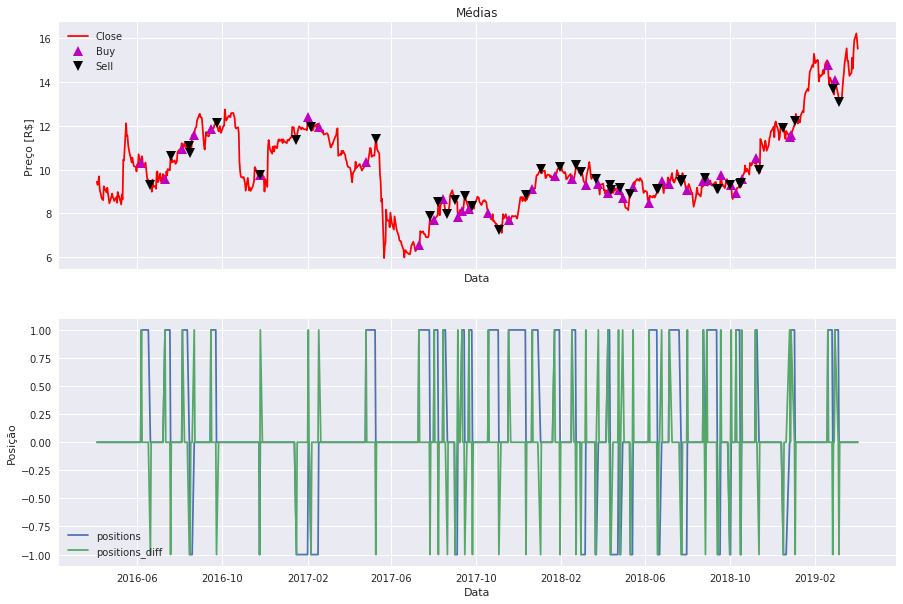
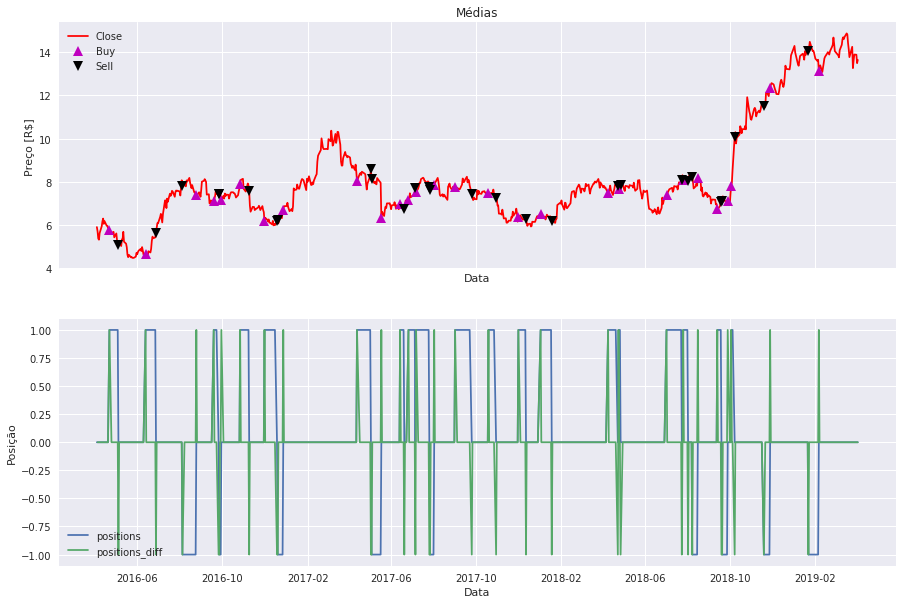
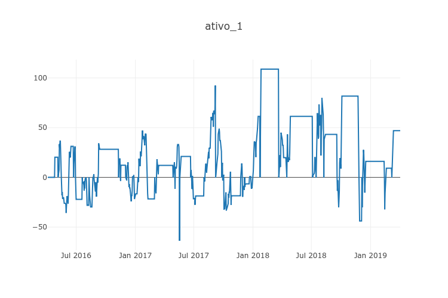
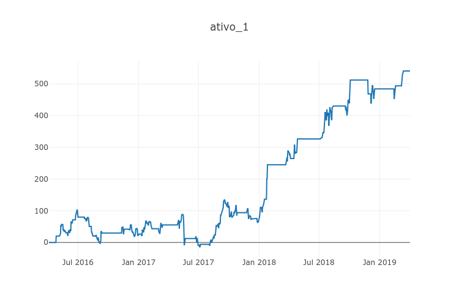
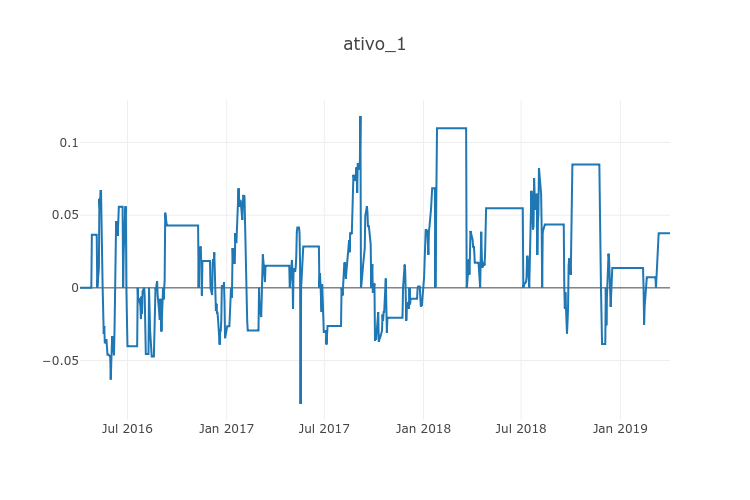
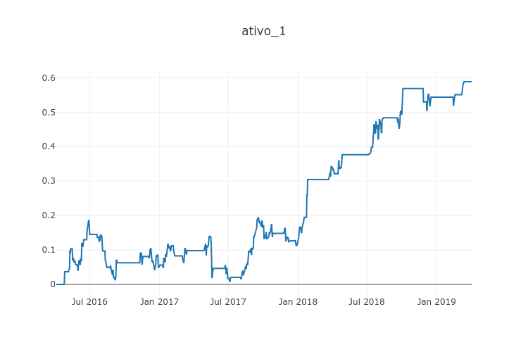

```python
#!/usr/bin/env python3
# -*- coding: utf-8 -*-
"""
Created on Mon Jan 29 09:11:31 2018
@autor: abhaybaraky

    Este código realiza a coleta dos dados historicos de ativos, implementa estratégias para venda e compra
das ações ao longo do tempo e calcula o retorno, lucro líquido, fator de lucro. Ademais, estabelece os por-
tifólios de Markowitz, que são ponderações de investimento, para uma melhor relação risco-retorno.

    Para cumprir os objetivos acima, o codigo se baseia em Dataframes da biblioteca Pandas.

"""
from plotly import tools
import plotly
import plotly.plotly as py
import plotly.graph_objs as go
plotly.offline.init_notebook_mode(connected=True) # run at the start of every notebook

import matplotlib.dates as mdates
from mpl_finance import candlestick_ohlc
import datetime
from pandas import *
import matplotlib.mlab as mlab
import scipy.signal as signal
import matplotlib.pyplot as plt
import numpy as np
import pandas as pd
pd.core.common.is_list_like = pd.api.types.is_list_like
import seaborn as sns
import pandas_datareader.data as pdr
import fix_yahoo_finance as yf
import datetime as dt
import matplotlib.ticker as mticker
sns.set()

def yahoo(symbols,S_Day, S_Month, S_Year, E_Day, E_Month, E_Year):
    yf.pdr_override()        
    stocks_yahoo = pdr.get_data_yahoo(symbols, start=datetime(S_Year, S_Month, S_Day), end=datetime(E_Year, E_Month, E_Day),   as_panel = False,)
    return stocks_yahoo

# Ativos para análise;
Stocks=['ITSA4', 'GOAU4', 'JBSS3', 'KROT3', 'CMIG4']
Stocks=[Stocks[k]+'.SA' for k in range(len(Stocks))]

# Definições para coleta de dados: número de meses desejados;
N_months=36
today = dt.date.today()
E_Day = today.day; E_Month = today.month; E_Year = today.year
day_before=today - dt.timedelta(days=N_months*365/12)
S_Day = day_before.day; S_Month = day_before.month; S_Year = day_before.year

stocks_all=yahoo(Stocks,S_Day, S_Month, S_Year, E_Day, E_Month, E_Year)

# Ordenação dos ativos com base da liquidez vista pelo Volume de capital;
Most_liquid_papers = stocks_all.Volume.iloc[:,:].mean().sort_values(ascending=False)
```


<script>requirejs.config({paths: { 'plotly': ['https://cdn.plot.ly/plotly-latest.min']},});if(!window.Plotly) {{require(['plotly'],function(plotly) {window.Plotly=plotly;});}}</script>


    [*********************100%***********************]  5 of 5 downloaded


```python
# Definições de alavancagem (leverage) e número de ativos para análise (t);
leverage = 100
t = 5

# O código coleta os dados de fechamento ajustados diários dos ativos e os armazena em Dataframes;
p1 = stocks_all['Adj Close'][Most_liquid_papers.index[0]]
p2 = stocks_all['Adj Close'][Most_liquid_papers.index[1]]
p3 = stocks_all['Adj Close'][Most_liquid_papers.index[2]]
p4 = stocks_all['Adj Close'][Most_liquid_papers.index[3]]
p5 = stocks_all['Adj Close'][Most_liquid_papers.index[4]]

# Reconstrução do Dataframe ordenado pelos ativos com maior liquidez;
k = 0
data = np.column_stack((p1,p2,p3,p4,p5))
dfp = pd.DataFrame(data, columns=[Most_liquid_papers.index[k]for k in range(0, len(Most_liquid_papers))], index=stocks_all.index)

# Construção de um novo data frame que armazena os retornos pontuais do capital ao longo dos dias;
returns = dfp.pct_change()

# Atribuir os retornos iniciais como 0;
returns.iloc[0] = [0, 0, 0, 0, 0]

# Nomear as colunas do Dataframe;
returns.columns = [Most_liquid_papers.index[k]for k in range(0, len(Most_liquid_papers))]


```


```python
"""
    Esta é a primeira estratégia que o algoritmo utiliza para realizar as movimentações financeira.
    
    O MACD utiliza duas médias exponenciais móveis com janelas predeterminadas, uma com janela menor e portanto com
variações mais rápidas e uma com janela maior e com variações mais lentas. É criado então um sinal chamado 
MACD_signal resultante da subtração da média rápida pela média lenta e um outro oriundo da média exponencial
do MACD_signal. 

    A operação de Compra ocorrerá no momento em que o sinal MACD_signal ultrapassar a sua média exponencial somado
à condição de que os sinais MACD_signal e sua média exponencial (signal) devem estar negativos. Esta movimentação
acabará no momento em que os dois nais se cruzarem novamente.

    Para a operação de Venda, teremos exatamente o contrário. Então a média exponencial deve ultrapassar o sinal
MACD_signal e a operação finalizará quando ambos os sinais se encontrarem novamente.

    A função armazena em um dataframe o valor 1 para os momentos que a estratégia está comprada, 0 para quando não
está realizando operações e -1 para quando está vendida. Este Dataframe é o resultado da estratégia.
    
"""

def MACD (FMA, SMA, SignalMA, short_window ,j):
    
    dfMACD = pd.DataFrame(index=stocks_all.index)
    dfMACD['FastA'] = dfp.iloc[:,j].ewm(span=FMA,min_periods=0,adjust=False,ignore_na=False).mean()
    dfMACD['SlowA'] = dfp.iloc[:,j].ewm(span=SMA,min_periods=0,adjust=False,ignore_na=False).mean()
    dfMACD['MACD_signal'] = dfMACD['FastA'] - dfMACD['SlowA']
    dfMACD['signal'] = dfMACD['MACD_signal'].ewm(span=SignalMA,min_periods=0,adjust=False,ignore_na=False).mean()
    
    dfMACD['buy'] = np.zeros(len(dfp.iloc[:,j]))
    
    comprou = False
    vendeu = False
    
    vector = np.zeros(len(dfp.iloc[:,j]))
    
    for i in range(short_window,len( dfp.iloc[:,j])):
        
        if( (comprou == False) & (vendeu == False) ):

            if((dfMACD.iloc[i,2] >= dfMACD.iloc[i,3])&(dfMACD.iloc[i,2]<0)&(dfMACD.iloc[i,3]<0)):
                vector[i] = 1
                comprou = True
                
            elif((dfMACD.iloc[i,2] <= dfMACD.iloc[i,3])&(dfMACD.iloc[i,2]>0)&(dfMACD.iloc[i,3]>0)):
                vector[i] = -1
                vendeu = True
                
            else:
                vector[i] = 0

                
        elif(comprou == True):
            
            if(dfMACD.iloc[i,2] < dfMACD.iloc[i,3]):
                vector[i] = 0
                comprou = False
                
            else:
                vector[i] = 1

            
        elif(vendeu == True):
            
            if(dfMACD.iloc[i,2] > dfMACD.iloc[i,3]):
                vector[i] = 0
                vendeu = False
                
            else:
                vector[i] = -1
            
        
        
    dfMACD['buy'] = vector

    
    return dfMACD['buy']
```


```python
"""
    Esta é a estratégia Aceleration, sua lógica foi criada por mim e corresponde à segunda estratégia que o algorit-
mo utiliza para realizar as movimentações financeira.

    É válido destacar a implementação dos conceitos de cálculo nesta função como forma de exemplificar uma aplicação
dos conceitos teóricos aprendidos em sala de aula.
    
    A Aceleration utiliza uma média móvel simples com janela predeterminada. A média é construída a partir da de-
rivada do histórico dos ativos com a finalidade de analisar as inclinações pontuais da curva e através disso estimar
limiares que determinão o nível de aceleração do ativo.

    A operação de Compra ocorrerá no momento em que forem respeitadas três condições. A média móvel das inclinações
deve ser maior que um limite inferior estabelecido, a média do histórico de valores da média móvel das inclinações
deve ser menor que um limite estabelecido e a média móvel das inclinações deve ser menor que um limite superior es-
tabelecido.

    A primeira condição visa garantir que o ativo esteja em uma ascenção constante mínima para realizar a compra,
a segunda condição tem o objetivo de impedir que o algoritmo realize compras quando o capital estiver sob alta osci-
lação e a terceira impede que a estratégia compre quando o ativo deixar o a operação de compra, pois ao finalizr a
compra a média da inclinação será alta.

    A operação de venda realiza exatamente o oposto, com a inversão dos mesmos limites.
    
    A saída das operações de compra e venda acontecerá mediante ao Stoploss e ao Stopgain. estes dois termos calcu-
lam a variação do preço da ação e estabelecem limites para que a estratégia continue comprada ou vendida.

    Parâmetros de entrada:
    dw = janela de diferenciação; 
    rw = janela da média móvel; 
    wsure = quantidade de amostras para verificar agitação sob o ativo;
    low_a = limte inferior da aceleração ou desaceleração;
    limit = limite superior da aceleração ou desaceleração;
    Stoploss = devalorização máxima permitida para o ativo;
    Stopgain = valorização máxima permitida para o ativo;
    
"""

def Aceleration (dw, rw, wsure,low_a, limit, StopLoss, StopGain, j):
    
    dfAC = pd.DataFrame(index=stocks_all.index)
    dfAC['ac_average'] = dfp.iloc[:,j].diff(periods=dw).rolling(window=rw).mean()
    
    dfAC['buy'] = np.zeros(len(dfp.iloc[:,j]))
    
    vector = np.zeros(len(dfp.iloc[:,j]))
    
    preco = 0
    comprou = False
    vendeu = False
    
    for i in range(rw,len(dfAC['ac_average'])):
        
        if( (comprou == False) & (vendeu == False) ):
            
            if( (dfAC.iloc[i,0].round(3) >= low_a) & (dfAC.iloc[(i-wsure):i,0].mean() < dfAC.iloc[i,0]) & (dfAC.iloc[i,0].round(3) <= limit)):
                comprou = True
                preco = dfp.iloc[i,j]
                vector[i] = 1
                
            elif( (dfAC.iloc[i,0].round(3) <= -low_a) & (dfAC.iloc[(i-wsure):i,0].mean() > dfAC.iloc[i,0]) & (dfAC.iloc[i,0].round(3) >= -limit)):
                vendeu = True
                preco = dfp.iloc[i,j]
                vector[i] = -1
            
            else:
                vector[i] = 0
                
                
        elif(comprou == True):
            if((dfp.iloc[i,j] <= (preco - StopLoss))):
                vector[i] = 0
                comprou = False
            
            elif(dfp.iloc[i,j] >= (preco + StopGain)):
                vector[i] = 0
                comprou = False
            else:
                vector[i] = 1
                
        elif(vendeu == True):
            if((dfp.iloc[i,j] >= (preco + StopLoss))):
                vector[i] = 0
                vendeu = False
            
            elif(dfp.iloc[i,j] <= (preco - StopGain)):
                vector[i] = 0
                vendeu = False
            else:
                vector[i] = -1
                
                
        
    dfAC['buy'] = vector
    
    return dfAC['buy']

```


```python
"""
    A terceira e ultima estratégia utilzada é o cruzamento das médias móveis simples.
    
    Quando a média móvel rápida cruzar a lenta se realiza a compra e o inverso a venda.

"""

# plot das operações de compra e venda para cada um dos 't' ativos;
for j in range(0,t):
    
    fig, ax = plt.subplots(nrows=2, ncols=1, sharex=True, figsize=(15,10))
    
    # set de parâmetros para a estratégia Aceleration;
    dw = 4; rw = 3; wsure = 10; low_a = 0.15; limit = 0.35; StopLoss = 0.6; StopGain = 0.8;
    
    # Janelas para as médias móveis;
    short_window = 10
    long_window = 21

    # Inicia sinal DataFrame;
    signals = pd.DataFrame(index=stocks_all.index)

    signals['signal'] = 0.0

    # Média Rápida;
    signals['short_mavg'] = dfp.iloc[:,j].rolling(window=short_window).mean()

    # Média Longa;
    signals['long_mavg'] =  dfp.iloc[:,j].rolling(window=long_window).mean()
    
    # MACD;
    signals['MACD'] = MACD(12,26,9,short_window,j)
    
    # Aceleration;
    signals['Aceleration'] = Aceleration(dw, rw, wsure,low_a, limit, StopLoss, StopGain, j)
    
    # Sinal de Entrada;
    # Realiza aqui a estratégia do cruamento das médias e armazena o array de 1 e -1 em uma uma coluna chamada 'signal';
    signals['signal'][short_window:] = np.where( (signals['short_mavg'][short_window:] > signals['long_mavg'][short_window:]) , 1.0, -1.0)
    
    
    
    # Posição dos trades
    # Neste momento o algoritmo faz a operação AND entre a estratégia do cruzamento das médias móveis e a estratégia Aceleration;
    # O vetor com as posições dos trades aramazena os momentos em que o código está comprado, vendido, ou nenhum dos dois;
    signals['positions'] = [signals.Aceleration[i] if(signals.Aceleration[i] == signals.signal.values[i]) else 0  for i in range(0,len(signals.Aceleration))]   #para usar o MACD
    
    # Por fim realiza-se o produto do vetor da posições anterior com as posições da estratégia MACD;
    signals['positions'] = signals.positions.values * signals.MACD.values
    
    # Agora aplica-se a derivada no vetor de posições para criar um nover vetor com os momentos de transição entre os estados de comprado, vendido e ocioso.
    signals['positions_diff'] = signals['positions'].diff()
    
    
    returns['p_diff_' + str(j)] = signals['positions']
    
    # Close
    ax[0].plot(dfp.iloc[:,j], label='Close',color='r')


    # Compra
    ax[0].plot(signals.loc[signals.positions_diff == 1.0].index, 
             dfp.iloc[:,j][signals.Aceleration[signals.positions_diff == 1.0].index],
             '^', markersize=10, color='m',label='Buy')

    # venda
    ax[0].plot(signals.loc[signals.positions_diff == -1.0].index, 
             dfp.iloc[:,j][signals.Aceleration[signals.positions_diff == -1.0].index],
             'v', markersize=10, color='k',label='Sell')


    ax[0].set_ylabel("Preço [R$]")
    ax[0].set_xlabel("Data")
    ax[0].set_title("Médias")
    ax[0].legend(loc='upper left')

    ax[1].plot(signals['positions'], label='positions')
    ax[1].plot(signals['positions_diff'], label='positions_diff')
    ax[1].set_ylabel("Posição")
    ax[1].set_xlabel("Data")
    ax[1].legend(loc='lower left')

```








```python
# Número de trades;

n_trade = [0, 0, 0, 0, 0]
for j in range(0,t):
    for i in range(1,len(returns.iloc[:,0])):
        if( (returns.iloc[i-1,j+5] == 0) & ((returns.iloc[i,j+5] == 1)|(returns.iloc[i,j+5] == -1))):
            n_trade[j] += 1
    
    if( returns.iloc[-1,j+5] == 1):
        n_trade[j] -= 1
            
display(n_trade)
```


    [37, 35, 41, 27, 28]


```python
# Retorno da estratégia;

"""

    O código agora implementa funções que calculam o retorno acumulado do capital e o risco.
    
    O entendimento desta função e de outras ao longo do código é extenso e será omitido, pois são protótipos que 
necessitam de otimização.

"""

MU = []
MU_op = []
Sigma = []
Sigma_op = []
acumulated_r = []
price_at = []

for j in range(0,t):
    mu = []
    r = [];
    r_prod = []
    profit = []
    flag = 0
    for i in range(1,len(returns.iloc[:,0])):
        
        if( ((flag == 1)|(flag == -1)) & (returns.iloc[i,j+5] == 0) ):
            if(flag == 1):
                r.append(1 + returns.iloc[i,j])
                mu.append(returns.iloc[i,j])
                
            if(flag == -1):
                r.append(1 - returns.iloc[i,j])
                mu.append(returns.iloc[i,j])
            
            flag = 0
            r_prod.append(np.prod(r)-1)
            r = []

        if( ( (returns.iloc[i-1,j+5] == 0) & (returns.iloc[i,j+5] == 1) ) |  (flag == 1) ) :
            if(flag == 0):
                profit.append(dfp.iloc[i,j])
                flag = 1
            else:    
                r.append(1 + returns.iloc[i,j])
                mu.append(returns.iloc[i,j])
            
            
        if( ( (returns.iloc[i-1,j+5] == 0) & (returns.iloc[i,j+5] == -1) ) |  (flag == -1) ):
            if(flag == 0):
                profit.append(dfp.iloc[i,j])
                flag = -1
            else:    
                r.append(1 - returns.iloc[i,j])
                mu.append(returns.iloc[i,j])
    
    if( (flag == 1)|(flag == -1) ):    
        profit.remove(profit[-1])
        
    price_at.append(profit)
    acumulated_r.append(r_prod)
    MU.append(np.mean(mu)) 
    MU_op.append(np.mean(r_prod))
    Sigma.append(np.std(mu))
    Sigma_op.append(np.std(r_prod))
```


```python
# robot_returns
"""

    Esta função implementa o cálcudo do indice sharpe, entretanto por questões da taxa de retorno de referência (rf)
e pelo período de tempo amostrado dos ativos, o índice sharpe resulta em valores errôneos. A soluçaõ para este proble-
ainda não foi encontrada por mim e seus efeitos são visíveis nas partes seguintes do código que implementam o porti-
fólio de Markowitz.

"""

Sigma_op = pd.Series(Sigma_op)
MU_op = pd.Series(MU_op)
Sigma = pd.Series(Sigma)
MU = pd.Series(MU)

MU_a = returns.iloc[:,0:5].mean()
Sigma_a = returns.iloc[:,0:5].std()

rf = 0.07424

sharpe_a = (MU_a- rf)/Sigma_a
sharpe = (MU - rf)/Sigma
sharpe_op = (MU_op - rf)/Sigma_op

display(sharpe_a)
display(sharpe_op)
display(sharpe)
```


    ITSA4.SA   -4.063414
    GOAU4.SA   -2.279506
    JBSS3.SA   -2.223179
    KROT3.SA   -2.781370
    CMIG4.SA   -2.566675
    dtype: float64


    0   -1.283272
    1   -0.826260
    2   -0.805502
    3   -1.032412
    4   -0.492569
    dtype: float64


    0   -4.156197
    1   -2.541636
    2   -2.933270
    3   -2.626347
    4   -2.522270
    dtype: float64


```python
# Taxa de Acerto
success_rate = np.zeros(t)
for j in range(0,t):
    for i in range(0, len(acumulated_r[j])):
        if(acumulated_r[j][i]>0):
            success_rate[j] += 100/len(acumulated_r[j])

display(success_rate)
```


    array([62.16216216, 60.        , 60.97560976, 51.85185185, 53.57142857])


```python
# Lucro Liquido
profit_factor = np.zeros(t)
for j in range(0,t):
    for i in range(0, len(acumulated_r[j])):
        profit_factor[j] += price_at[j][i]*leverage*acumulated_r[j][i]
        
display(profit_factor)
```


    array([545.41191915, 219.80887554, 496.51263913, 221.57091067,
           629.84139885])


```python
# Luco liquido total
profit_factor.sum()
```


    2113.145743334332


```python
# Fator de Lucro

profit_fac = np.zeros(t)

for j in range(0,t):
    ganho = 0
    perdas = 0
    
    for i in range(0, len(acumulated_r[j])):
        if(acumulated_r[j][i]>0):
            ganho += price_at[j][i]*leverage*acumulated_r[j][i]
        
        if(acumulated_r[j][i]<0):
            perdas += price_at[j][i]*leverage*acumulated_r[j][i]
    
    profit_fac[j] = ganho/np.abs(perdas)
        
display(profit_fac)
```


    array([2.70862384, 1.52649896, 1.56257529, 1.31959894, 2.67926202])


```python
# Retornos de Capital
robot_return  = np.zeros(t)
for j in range(0,t):
    for i in range(0, len(acumulated_r[j])):
        acu_r = np.array(acumulated_r[j])
        robot_return[j] = np.sum(acu_r)
        
display(robot_return)
```


    array([0.5954114 , 0.42300342, 0.72696587, 0.25757382, 0.82802539])


```python
# Cálculo do lucro líquido resultante dos ganhos vistos pelos retornos acumulados
Capital_liquido = []
Retorno_liquido = []
for j in range(0,t):
    flag = True
    flag2 = True
    flag3 = True
    aux = np.array([])
    r_aux = np.array([])
    fixed_price = []
    for i in range(0,len(returns.iloc[:,5])):
        if(returns.iloc[i,j+5] != 0):
            
            sinal = returns.iloc[i,j+5]
            
            if(flag == True):
                
                if(flag3 == False):
                    r_aux = (np.cumprod(r_aux + 1)-1)
                    aux = np.concatenate([aux, r_aux])
                    r_aux = []
                    
                flag = False
                fixed_price.append(dfp.iloc[i,j])
                r_aux = np.append(r_aux, 0)
                    
                flag3 = False
                
            else:
                r_aux = np.append(r_aux, returns.iloc[i,j] * sinal)
                fixed_price.append(fixed_price[-1])
        else:
            
            if(flag == False):
                fixed_price.append(fixed_price[-1])
                r_aux = np.append(r_aux, returns.iloc[i,j] * sinal ) 
                flag = True
            elif(flag2 == True):
                fixed_price.append(0)
                r_aux = np.append(r_aux, 0)
                flag2 = False
            else:
                fixed_price.append(fixed_price[-1])
                r_aux = np.append(r_aux, 0)
                
    
    r_aux = (np.cumprod(r_aux + 1)-1)
    aux = np.concatenate([aux, r_aux])
    fixed_price = np.array(fixed_price)
    Capital_liquido.append(aux*fixed_price*leverage)
    Retorno_liquido.append(aux)
```


```python
"""

    Então o código realiza a organização dos dados do lucro líquido e do retorno líquido para plotagem.

"""
final_gain = []

for j in range(0,t):
    gain = np.zeros(len(returns.iloc[:,6]))
    last_price = 0
    
    for i in range(0,len(returns.iloc[:,6])):
        if(Capital_liquido[j][i] == 0):
            last_price = gain[i-1]
        
        gain[i] = Capital_liquido[j][i] + last_price
            
    
    final_gain.append(gain)
    
final_gain = np.array(final_gain)
```


```python
final_return = []

for j in range(0,t):
    gain2 = np.zeros(len(returns.iloc[:,6]))
    last_price2 = 0
    
    for i in range(0,len(returns.iloc[:,6])):
        if(Retorno_liquido[j][i] == 0):
            last_price2 = gain2[i-1]
        
        gain2[i] = Retorno_liquido[j][i] + last_price2
            
    
    final_return.append(gain2)
    
final_return = np.array(final_return)
```


```python
cl1 = np.array(Capital_liquido[0])
cl2 = np.array(Capital_liquido[1])
cl3 = np.array(Capital_liquido[2])
cl4 = np.array(Capital_liquido[3])
cl5 = np.array(Capital_liquido[4])

Capital_cl = pd.DataFrame(cl1, columns= ['ativo_1'], index=stocks_all.index)
Capital_cl['ativo_2'] = cl2
Capital_cl['ativo_3'] = cl3
Capital_cl['ativo_4'] = cl4
Capital_cl['ativo_5'] = cl5
```


```python
rl1 = np.array(Retorno_liquido[0])
rl2 = np.array(Retorno_liquido[1])
rl3 = np.array(Retorno_liquido[2])
rl4 = np.array(Retorno_liquido[3])
rl5 = np.array(Retorno_liquido[4])

Capital_rl = pd.DataFrame(rl1, columns= ['ativo_1'], index=stocks_all.index)
Capital_rl['ativo_2'] = rl2
Capital_rl['ativo_3'] = rl3
Capital_rl['ativo_4'] = rl4
Capital_rl['ativo_5'] = rl5
```


```python
g1 = np.array(final_gain[0])
g2 = np.array(final_gain[1])
g3 = np.array(final_gain[2])
g4 = np.array(final_gain[3])
g5 = np.array(final_gain[4])

Capital_g = pd.DataFrame(g1, columns= ['ativo_1'], index=stocks_all.index)
Capital_g['ativo_2'] = g2
Capital_g['ativo_3'] = g3
Capital_g['ativo_4'] = g4
Capital_g['ativo_5'] = g5
```


```python
r1 = np.array(final_return[0])
r2 = np.array(final_return[1])
r3 = np.array(final_return[2])
r4 = np.array(final_return[3])
r5 = np.array(final_return[4])

Capital_r = pd.DataFrame(r1, columns= ['ativo_1'], index=stocks_all.index)
Capital_r['ativo_2'] = r2
Capital_r['ativo_3'] = r3
Capital_r['ativo_4'] = r4
Capital_r['ativo_5'] = r5
```


```python
def Plot_fig (Stock, c='r'):
    layout = go.Layout(title=Stock.name ,autosize=False, width=750, height=500)
    data = [go.Scatter( x=Stock.index, y=Stock )]
    plotly.offline.iplot(go.Figure(data= data, layout=layout))
```


```python
# Lucros líquidos pontuais das operações
x = 0

Plot_fig(Capital_cl.iloc[:,x])
```




```python
# Evolução dos lucros líquidos das operações 
Plot_fig(Capital_g.iloc[:,x])
```




```python
# Retornos acumulados pontuais das operações
Plot_fig(Capital_rl.iloc[:,x])
```




```python
# Evolução do retorno acumulado ao longo das operações
Plot_fig(Capital_r.iloc[:,x])
```




```python
rM1 = np.array(returns.iloc[:,0] * returns.iloc[:,5])
rM2 = np.array(returns.iloc[:,1] * returns.iloc[:,6])
rM3 = np.array(returns.iloc[:,2] * returns.iloc[:,7])
rM4 = np.array(returns.iloc[:,3] * returns.iloc[:,8])
rM5 = np.array(returns.iloc[:,4] * returns.iloc[:,9])

Markowitz = pd.DataFrame(rM1, columns= ['ativo_1'])
Markowitz['ativo_2'] = rM2
Markowitz['ativo_3'] = rM3
Markowitz['ativo_4'] = rM4
Markowitz['ativo_5'] = rM5
```


```python
"""
    Agora implementa-se o cálculo dos portifólios de Markowitz: a plotagem do diagrama Risco x Retorno, da curva
de eficiência, o portfólio de menor risco e o portfólio com maior índice Sharpe.

    A curva de eficiência nada mais é do que a curva azul do diagrama de Risco x Retorno resultante da plotagem,
ela estabelece os melhores portifólios para os riscos assumidos. O portifólio de menor risco e o portifólio com
maior indice sharpe são ponderações estabelecidas para melhor aplicar o capital. O de menor risco aparece na extre-
midade da curva de capital e assim oferece a ponderação para o investimento de menor risco, já o portifólio de maior
índice sharpe tem a ponderação para a melhor relação de risco x retorno.

    Vale ressaltar que quando o portifólio resulta em ponderações negativas ele indica para entrar vendido nas opera-
ções no deterinado ativo.

    A teoria aqui colcoada pode ser encotrada no livro: Ali N. Akansu, Mustafa U. Torun A Primer for Financial Engi-
neering Financial Signal Processing and Electronic Trading.

"""
C=Markowitz.cov()
sig=Markowitz.std() 
MU=Markowitz.mean()*21
I=pd.DataFrame(np.identity(5))
SIGMA=(C*(I.values))**0.5
P=Markowitz.corr()
ONE=[1,1,1,1,1]
N=1000
ret=pd.DataFrame(np.zeros((N,1)))
risk=pd.DataFrame(np.zeros((N,1)))


for i in range(0, N):
    qabs = np.random.normal(0,100, 5)  
    qmx=qabs.max()
    qn=qabs/qmx     #normalização do vetor
    qn1=qn/qn.sum() #tornando a soma dos coeficientes de distribuição = 1 (caso ideal)
    q=qn1.round(2)
#    print(q)
    if i==1:
        q=[1/5,1/5,1/5,1/5,1/5]
    ret[0][i]=np.dot(pd.DataFrame(q).transpose(),MU)
    risk[0][i]=(np.dot(np.dot(pd.DataFrame(q).transpose(),C),pd.DataFrame(q)))**0.5
```


```python

a=np.dot(pd.DataFrame(MU).transpose(),np.dot(np.linalg.inv(C),pd.DataFrame(MU)))
b=np.dot(pd.DataFrame(ONE).transpose(),np.dot(np.linalg.inv(C),pd.DataFrame(MU)))
c=np.dot(pd.DataFrame(MU).transpose(),np.dot(np.linalg.inv(C),pd.DataFrame(ONE)))
d=np.dot(pd.DataFrame(ONE).transpose(),np.dot(np.linalg.inv(C),pd.DataFrame(ONE)))
target_mus=np.arange(-0.3,0.3,0.0002)           #vetor de variação de MU
risk_at_target_mus=np.zeros(len(target_mus))    #inicializou o vetor do risco para MU
for i in range(0, len(target_mus)):
    target_mu=target_mus[i]
    v1=np.linalg.det([[target_mu,b[0][0]],[1,d[0][0]]])*np.dot(np.linalg.inv(C),pd.DataFrame(MU))
    v2=np.linalg.det([[a[0][0],target_mu],[c[0][0],1]])*np.dot(np.linalg.inv(C),pd.DataFrame(ONE))
    v3=np.linalg.det([[a[0][0],b[0][0]],[c[0][0],d[0][0]]])
    opt_q=(v1+v2)/v3
    risk_at_target_mus[i]=(np.dot(np.dot(pd.DataFrame(opt_q).transpose(),C),pd.DataFrame(opt_q)))**0.5
```


```python
q_minrisk=np.dot(np.linalg.inv(C),pd.DataFrame(ONE))/d
mu_minrisk=np.dot(q_minrisk.transpose(),MU.values)
risk_minrisk=(np.dot(np.dot(pd.DataFrame(q_minrisk).transpose(),C),pd.DataFrame(q_minrisk)))**0.5

```


```python
rf=0.0744
temp=np.dot(np.linalg.inv(C),pd.DataFrame(MU-np.dot(ONE,rf)))
qm=temp/temp.sum()
mu_m=np.dot(qm.transpose(),MU)
sigma_m=(np.dot(np.dot(pd.DataFrame(qm).transpose(),C),pd.DataFrame(qm)))**0.5
cm_line=sigma_m[0][0]*(target_mus-rf)/(mu_m-rf)
arbitrary_line=sig[0]*(target_mus-rf)/(MU[0]-rf)

fig = plt.figure(figsize=(20,10))
plt.plot(100*risk,100*ret,'r*')
plt.plot(100*risk_at_target_mus,100*target_mus,'b*')
plt.plot(100*sig[0], 100*MU[0], 'g*', markersize=15.0)  
plt.plot(100*sig[1], 100*MU[1], 'g*', markersize=15.0)  
plt.plot(100*sig[2], 100*MU[2], 'g*', markersize=15.0) 
plt.plot(100*sig[3], 100*MU[3], 'g*', markersize=15.0) 
plt.plot(100*sig[3], 100*MU[4], 'g*', markersize=15.0) 
plt.text(100*sig[0]+0.1, 100*MU[0],'A1' , fontsize=16)
plt.text(100*sig[1]+0.1, 100*MU[1],'A2' , fontsize=16)
plt.text(100*sig[2]+0.1, 100*MU[2],'A3' , fontsize=16)
plt.text(100*sig[3]+0.1, 100*MU[3],'A4' , fontsize=16)
plt.text(100*sig[3]+0.1, 100*MU[4],'A4' , fontsize=16)
plt.plot(100*cm_line,100*target_mus,'y--')
plt.plot(0, 100*rf, 'g*', markersize=15.0)
plt.plot(100*sigma_m,100*mu_m,'y*',markersize=25.0)
plt.plot(100*arbitrary_line, 100*target_mus, 'k--');
plt.plot(100*risk_minrisk,100*mu_minrisk,'k*',markersize=15)
plt.axis([-0.5,12,-18,30])
plt.title('Teoria Moderna do Portfólio - Markowitz (1952),')
plt.ylabel('Retorno do Capital Mensal [%]')
plt.xlabel('Risco do Capital mensal [%]')
```


    Text(0.5,0,'Risco do Capital mensal [%]')


```python
# Portifólio de menor risco
q_minrisk
```


    array([[0.27705217],
           [0.09194776],
           [0.18198572],
           [0.2845251 ],
           [0.16448925]])


```python
# Portifólio de maior Índice Sharpe
qm
```


    array([[0.26078153],
           [0.088203  ],
           [0.17766968],
           [0.32290031],
           [0.15044547]])


