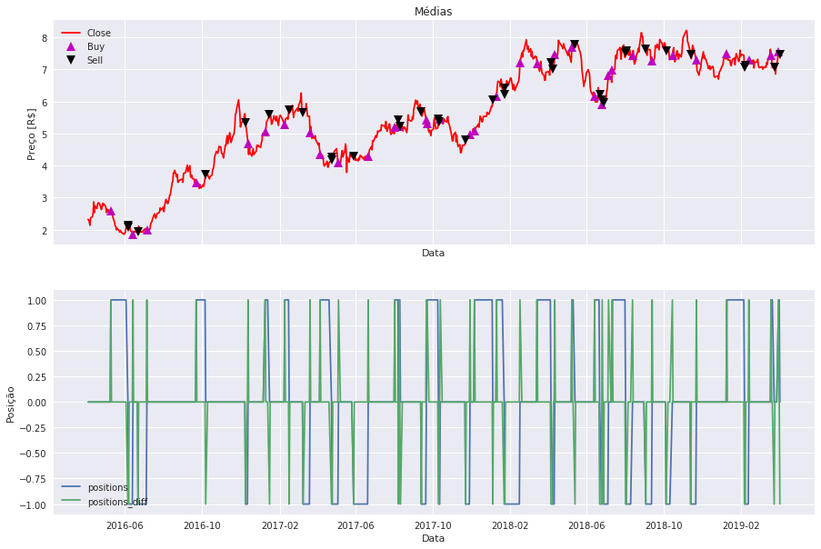
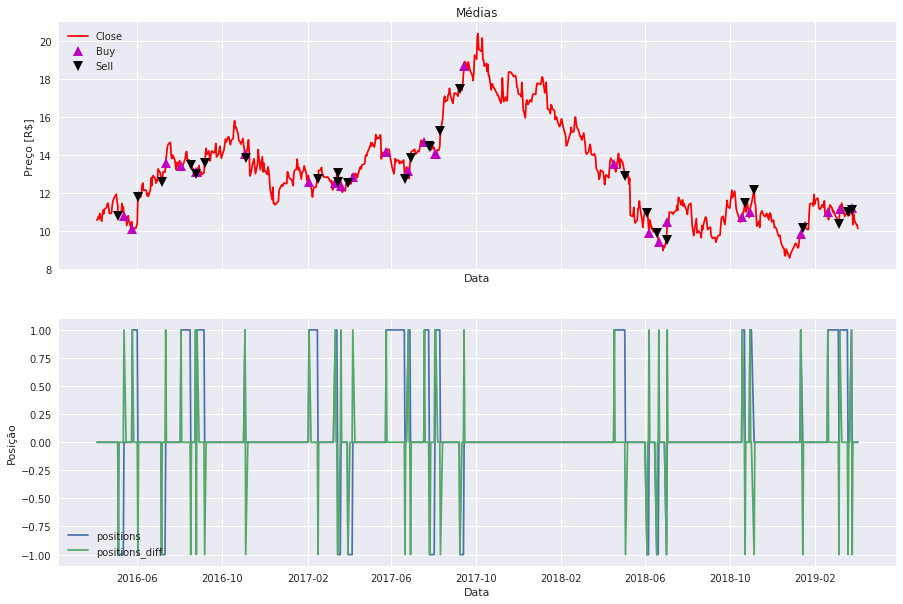
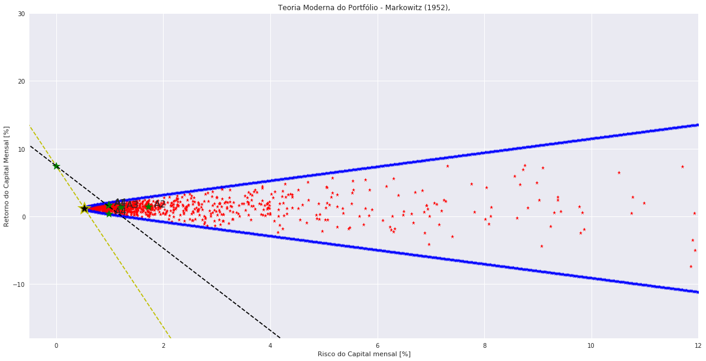

```python
#!/usr/bin/env python3
# -*- coding: utf-8 -*-
"""
Created on Mon Jan 29 09:11:31 2018
@autor: abhaybaraky

    Este código realiza a coleta dos dados historicos de ativos, implementa estratégias para venda e compra
das ações ao longo do tempo e calcula o retorno, lucro líquido, fator de lucro. Ademais, estabelece os por-
tifólios de Markowitz, que são ponderações de investimento, para uma melhor relação risco-retorno.

    Para cumprir os objetivos acima, o codigo se baseia em Dataframes da biblioteca Pandas.

"""
from plotly import tools
import plotly
import plotly.plotly as py
import plotly.graph_objs as go
plotly.offline.init_notebook_mode(connected=True) # run at the start of every notebook

import matplotlib.dates as mdates
from mpl_finance import candlestick_ohlc
import datetime
from pandas import *
import matplotlib.mlab as mlab
import scipy.signal as signal
import matplotlib.pyplot as plt
import numpy as np
import pandas as pd
pd.core.common.is_list_like = pd.api.types.is_list_like
import seaborn as sns
import pandas_datareader.data as pdr
import fix_yahoo_finance as yf
import datetime as dt
import matplotlib.ticker as mticker
sns.set()

def yahoo(symbols,S_Day, S_Month, S_Year, E_Day, E_Month, E_Year):
    yf.pdr_override()        
    stocks_yahoo = pdr.get_data_yahoo(symbols, start=datetime(S_Year, S_Month, S_Day), end=datetime(E_Year, E_Month, E_Day),   as_panel = False,)
    return stocks_yahoo

# Ativos para análise;
Stocks=['ITSA4', 'GOAU4', 'JBSS3', 'KROT3', 'CMIG4']
Stocks=[Stocks[k]+'.SA' for k in range(len(Stocks))]

# Definições para coleta de dados: número de meses desejados;
N_months=36
today = dt.date.today()
E_Day = today.day; E_Month = today.month; E_Year = today.year
day_before=today - dt.timedelta(days=N_months*365/12)
S_Day = day_before.day; S_Month = day_before.month; S_Year = day_before.year

stocks_all=yahoo(Stocks,S_Day, S_Month, S_Year, E_Day, E_Month, E_Year)

# Ordenação dos ativos com base da liquidez vista pelo Volume de capital;
Most_liquid_papers = stocks_all.Volume.iloc[:,:].mean().sort_values(ascending=False)
```


<script>requirejs.config({paths: { 'plotly': ['https://cdn.plot.ly/plotly-latest.min']},});if(!window.Plotly) {{require(['plotly'],function(plotly) {window.Plotly=plotly;});}}</script>


    [*********************100%***********************]  5 of 5 downloaded


```python
# Definições de alavancagem (leverage) e número de ativos para análise (t);
leverage = 100
t = 5

# O código coleta os dados de fechamento ajustados diários dos ativos e os armazena em Dataframes;
p1 = stocks_all['Adj Close'][Most_liquid_papers.index[0]]
p2 = stocks_all['Adj Close'][Most_liquid_papers.index[1]]
p3 = stocks_all['Adj Close'][Most_liquid_papers.index[2]]
p4 = stocks_all['Adj Close'][Most_liquid_papers.index[3]]
p5 = stocks_all['Adj Close'][Most_liquid_papers.index[4]]

# Reconstrução do Dataframe ordenado pelos ativos com maior liquidez;
k = 0
data = np.column_stack((p1,p2,p3,p4,p5))
dfp = pd.DataFrame(data, columns=[Most_liquid_papers.index[k]for k in range(0, len(Most_liquid_papers))], index=stocks_all.index)

# Construção de um novo data frame que armazena os retornos pontuais do capital ao longo dos dias;
returns = dfp.pct_change()

# Atribuir os retornos iniciais como 0;
returns.iloc[0] = [0, 0, 0, 0, 0]

# Nomear as colunas do Dataframe;
returns.columns = [Most_liquid_papers.index[k]for k in range(0, len(Most_liquid_papers))]


```


```python
"""
    Esta é a primeira estratégia que o algoritmo utiliza para realizar as movimentações financeira.
    
    O MACD utiliza duas médias exponenciais móveis com janelas predeterminadas, uma com janela menor e portanto com
variações mais rápidas e uma com janela maior e com variações mais lentas. É criado então um sinal chamado 
MACD_signal resultante da subtração da média rápida pela média lenta e um outro oriundo da média exponencial
do MACD_signal. 

    A operação de Compra ocorrerá no momento em que o sinal MACD_signal ultrapassar a sua média exponencial somado
à condição de que os sinais MACD_signal e sua média exponencial (signal) devem estar negativos. Esta movimentação
acabará no momento em que os dois nais se cruzarem novamente.

    Para a operação de Venda, teremos exatamente o contrário. Então a média exponencial deve ultrapassar o sinal
MACD_signal e a operação finalizará quando ambos os sinais se encontrarem novamente.

    A função armazena em um dataframe o valor 1 para os momentos que a estratégia está comprada, 0 para quando não
está realizando operações e -1 para quando está vendida. Este Dataframe é o resultado da estratégia.
    
"""

def MACD (FMA, SMA, SignalMA, short_window ,j):
    
    dfMACD = pd.DataFrame(index=stocks_all.index)
    dfMACD['FastA'] = dfp.iloc[:,j].ewm(span=FMA,min_periods=0,adjust=False,ignore_na=False).mean()
    dfMACD['SlowA'] = dfp.iloc[:,j].ewm(span=SMA,min_periods=0,adjust=False,ignore_na=False).mean()
    dfMACD['MACD_signal'] = dfMACD['FastA'] - dfMACD['SlowA']
    dfMACD['signal'] = dfMACD['MACD_signal'].ewm(span=SignalMA,min_periods=0,adjust=False,ignore_na=False).mean()
    
    dfMACD['buy'] = np.zeros(len(dfp.iloc[:,j]))
    
    comprou = False
    vendeu = False
    
    vector = np.zeros(len(dfp.iloc[:,j]))
    
    for i in range(short_window,len( dfp.iloc[:,j])):
        
        if( (comprou == False) & (vendeu == False) ):

            if((dfMACD.iloc[i,2] >= dfMACD.iloc[i,3])&(dfMACD.iloc[i,2]<0)&(dfMACD.iloc[i,3]<0)):
                vector[i] = 1
                comprou = True
                
            elif((dfMACD.iloc[i,2] <= dfMACD.iloc[i,3])&(dfMACD.iloc[i,2]>0)&(dfMACD.iloc[i,3]>0)):
                vector[i] = -1
                vendeu = True
                
            else:
                vector[i] = 0

                
        elif(comprou == True):
            
            if(dfMACD.iloc[i,2] < dfMACD.iloc[i,3]):
                vector[i] = 0
                comprou = False
                
            else:
                vector[i] = 1

            
        elif(vendeu == True):
            
            if(dfMACD.iloc[i,2] > dfMACD.iloc[i,3]):
                vector[i] = 0
                vendeu = False
                
            else:
                vector[i] = -1
            
        
        
    dfMACD['buy'] = vector

    
    return dfMACD['buy']
```


```python
"""
    Esta é a estratégia Aceleration, sua lógica foi criada por mim e corresponde à segunda estratégia que o algorit-
mo utiliza para realizar as movimentações financeira.

    É válido destacar a implementação dos conceitos de cálculo nesta função como forma de exemplificar uma aplicação
dos conceitos teóricos aprendidos em sala de aula.
    
    A Aceleration utiliza uma média móvel simples com janela predeterminada. A média é construída a partir da de-
rivada do histórico dos ativos com a finalidade de analisar as inclinações pontuais da curva e através disso estimar
limiares que determinão o nível de aceleração do ativo.

    A operação de Compra ocorrerá no momento em que forem respeitadas três condições. A média móvel das inclinações
deve ser maior que um limite inferior estabelecido, a média do histórico de valores da média móvel das inclinações
deve ser menor que um limite estabelecido e a média móvel das inclinações deve ser menor que um limite superior es-
tabelecido.

    A primeira condição visa garantir que o ativo esteja em uma ascenção constante mínima para realizar a compra,
a segunda condição tem o objetivo de impedir que o algoritmo realize compras quando o capital estiver sob alta osci-
lação e a terceira impede que a estratégia compre quando o ativo deixar o a operação de compra, pois ao finalizr a
compra a média da inclinação será alta.

    A operação de venda realiza exatamente o oposto, com a inversão dos mesmos limites.
    
    A saída das operações de compra e venda acontecerá mediante ao Stoploss e ao Stopgain. estes dois termos calcu-
lam a variação do preço da ação e estabelecem limites para que a estratégia continue comprada ou vendida.

    Parâmetros de entrada:
    dw = janela de diferenciação; 
    rw = janela da média móvel; 
    wsure = quantidade de amostras para verificar agitação sob o ativo;
    low_a = limte inferior da aceleração ou desaceleração;
    limit = limite superior da aceleração ou desaceleração;
    Stoploss = devalorização máxima permitida para o ativo;
    Stopgain = valorização máxima permitida para o ativo;
    
"""

def Aceleration (dw, rw, wsure,low_a, limit, StopLoss, StopGain, j):
    
    dfAC = pd.DataFrame(index=stocks_all.index)
    dfAC['ac_average'] = dfp.iloc[:,j].diff(periods=dw).rolling(window=rw).mean()
    
    dfAC['buy'] = np.zeros(len(dfp.iloc[:,j]))
    
    vector = np.zeros(len(dfp.iloc[:,j]))
    
    preco = 0
    comprou = False
    vendeu = False
    
    for i in range(rw,len(dfAC['ac_average'])):
        
        if( (comprou == False) & (vendeu == False) ):
            
            if( (dfAC.iloc[i,0].round(3) >= low_a) & (dfAC.iloc[(i-wsure):i,0].mean() < dfAC.iloc[i,0]) & (dfAC.iloc[i,0].round(3) <= limit)):
                comprou = True
                preco = dfp.iloc[i,j]
                vector[i] = 1
                
            elif( (dfAC.iloc[i,0].round(3) <= -low_a) & (dfAC.iloc[(i-wsure):i,0].mean() > dfAC.iloc[i,0]) & (dfAC.iloc[i,0].round(3) >= -limit)):
                vendeu = True
                preco = dfp.iloc[i,j]
                vector[i] = -1
            
            else:
                vector[i] = 0
                
                
        elif(comprou == True):
            if((dfp.iloc[i,j] <= (preco - StopLoss))):
                vector[i] = 0
                comprou = False
            
            elif(dfp.iloc[i,j] >= (preco + StopGain)):
                vector[i] = 0
                comprou = False
            else:
                vector[i] = 1
                
        elif(vendeu == True):
            if((dfp.iloc[i,j] >= (preco + StopLoss))):
                vector[i] = 0
                vendeu = False
            
            elif(dfp.iloc[i,j] <= (preco - StopGain)):
                vector[i] = 0
                vendeu = False
            else:
                vector[i] = -1
                
                
        
    dfAC['buy'] = vector
    
    return dfAC['buy']

```


```python
"""
    A terceira e ultima estratégia utilzada é o cruzamento das médias móveis simples.
    
    Quando a média móvel rápida cruzar a lenta se realiza a compra e o inverso a venda.

"""

# plot das operações de compra e venda para cada um dos 't' ativos;
for j in range(0,t):
    
    fig, ax = plt.subplots(nrows=2, ncols=1, sharex=True, figsize=(15,10))
    
    # set de parâmetros para a estratégia Aceleration;
    dw = 4; rw = 3; wsure = 10; low_a = 0.15; limit = 0.35; StopLoss = 0.6; StopGain = 0.8;
    
    # Janelas para as médias móveis;
    short_window = 10
    long_window = 21

    # Inicia sinal DataFrame;
    signals = pd.DataFrame(index=stocks_all.index)

    signals['signal'] = 0.0

    # Média Rápida;
    signals['short_mavg'] = dfp.iloc[:,j].rolling(window=short_window).mean()

    # Média Longa;
    signals['long_mavg'] =  dfp.iloc[:,j].rolling(window=long_window).mean()
    
    # MACD;
    signals['MACD'] = MACD(12,26,9,short_window,j)
    
    # Aceleration;
    signals['Aceleration'] = Aceleration(dw, rw, wsure,low_a, limit, StopLoss, StopGain, j)
    
    # Sinal de Entrada;
    # Realiza aqui a estratégia do cruamento das médias e armazena o array de 1 e -1 em uma uma coluna chamada 'signal';
    signals['signal'][short_window:] = np.where( (signals['short_mavg'][short_window:] > signals['long_mavg'][short_window:]) , 1.0, -1.0)
    
    
    
    # Posição dos trades
    # Neste momento o algoritmo faz a operação AND entre a estratégia do cruzamento das médias móveis e a estratégia Aceleration;
    # O vetor com as posições dos trades aramazena os momentos em que o código está comprado, vendido, ou nenhum dos dois;
    signals['positions'] = [signals.Aceleration[i] if(signals.Aceleration[i] == signals.signal.values[i]) else 0  for i in range(0,len(signals.Aceleration))]   #para usar o MACD
    
    # Por fim realiza-se o produto do vetor da posições anterior com as posições da estratégia MACD;
    signals['positions'] = signals.positions.values * signals.MACD.values
    
    # Agora aplica-se a derivada no vetor de posições para criar um nover vetor com os momentos de transição entre os estados de comprado, vendido e ocioso.
    signals['positions_diff'] = signals['positions'].diff()
    
    
    returns['p_diff_' + str(j)] = signals['positions']
    
    # Close
    ax[0].plot(dfp.iloc[:,j], label='Close',color='r')


    # Compra
    ax[0].plot(signals.loc[signals.positions_diff == 1.0].index, 
             dfp.iloc[:,j][signals.Aceleration[signals.positions_diff == 1.0].index],
             '^', markersize=10, color='m',label='Buy')

    # venda
    ax[0].plot(signals.loc[signals.positions_diff == -1.0].index, 
             dfp.iloc[:,j][signals.Aceleration[signals.positions_diff == -1.0].index],
             'v', markersize=10, color='k',label='Sell')


    ax[0].set_ylabel("Preço [R$]")
    ax[0].set_xlabel("Data")
    ax[0].set_title("Médias")
    ax[0].legend(loc='upper left')

    ax[1].plot(signals['positions'], label='positions')
    ax[1].plot(signals['positions_diff'], label='positions_diff')
    ax[1].set_ylabel("Posição")
    ax[1].set_xlabel("Data")
    ax[1].legend(loc='lower left')

```








```python
# Número de trades;

n_trade = [0, 0, 0, 0, 0]
for j in range(0,t):
    for i in range(1,len(returns.iloc[:,0])):
        if( (returns.iloc[i-1,j+5] == 0) & ((returns.iloc[i,j+5] == 1)|(returns.iloc[i,j+5] == -1))):
            n_trade[j] += 1
    
    if( returns.iloc[-1,j+5] == 1):
        n_trade[j] -= 1
            
display(n_trade)
```


    [37, 35, 41, 27, 28]


```python
# Retorno da estratégia;

"""

    O código agora implementa funções que calculam o retorno acumulado do capital e o risco.
    
    O entendimento desta função e de outras ao longo do código é extenso e será omitido, pois são protótipos que 
necessitam de otimização.

"""

MU = []
MU_op = []
Sigma = []
Sigma_op = []
acumulated_r = []
price_at = []

for j in range(0,t):
    mu = []
    r = [];
    r_prod = []
    profit = []
    flag = 0
    for i in range(1,len(returns.iloc[:,0])):
        
        if( ((flag == 1)|(flag == -1)) & (returns.iloc[i,j+5] == 0) ):
            if(flag == 1):
                r.append(1 + returns.iloc[i,j])
                mu.append(returns.iloc[i,j])
                
            if(flag == -1):
                r.append(1 - returns.iloc[i,j])
                mu.append(returns.iloc[i,j])
            
            flag = 0
            r_prod.append(np.prod(r)-1)
            r = []

        if( ( (returns.iloc[i-1,j+5] == 0) & (returns.iloc[i,j+5] == 1) ) |  (flag == 1) ) :
            if(flag == 0):
                profit.append(dfp.iloc[i,j])
                flag = 1
            else:    
                r.append(1 + returns.iloc[i,j])
                mu.append(returns.iloc[i,j])
            
            
        if( ( (returns.iloc[i-1,j+5] == 0) & (returns.iloc[i,j+5] == -1) ) |  (flag == -1) ):
            if(flag == 0):
                profit.append(dfp.iloc[i,j])
                flag = -1
            else:    
                r.append(1 - returns.iloc[i,j])
                mu.append(returns.iloc[i,j])
    
    if( (flag == 1)|(flag == -1) ):    
        profit.remove(profit[-1])
        
    price_at.append(profit)
    acumulated_r.append(r_prod)
    MU.append(np.mean(mu)) 
    MU_op.append(np.mean(r_prod))
    Sigma.append(np.std(mu))
    Sigma_op.append(np.std(r_prod))
```


```python
# robot_returns
"""

    Esta função implementa o cálcudo do indice sharpe, entretanto por questões da taxa de retorno de referência (rf)
e pelo período de tempo amostrado dos ativos, o índice sharpe resulta em valores errôneos. A soluçaõ para este proble-
ainda não foi encontrada por mim e seus efeitos são visíveis nas partes seguintes do código que implementam o porti-
fólio de Markowitz.

"""

Sigma_op = pd.Series(Sigma_op)
MU_op = pd.Series(MU_op)
Sigma = pd.Series(Sigma)
MU = pd.Series(MU)

MU_a = returns.iloc[:,0:5].mean()
Sigma_a = returns.iloc[:,0:5].std()

rf = 0.07424

sharpe_a = (MU_a- rf)/Sigma_a
sharpe = (MU - rf)/Sigma
sharpe_op = (MU_op - rf)/Sigma_op

display(sharpe_a)
display(sharpe_op)
display(sharpe)
```


    ITSA4.SA   -4.063414
    GOAU4.SA   -2.279506
    JBSS3.SA   -2.223179
    KROT3.SA   -2.781370
    CMIG4.SA   -2.566675
    dtype: float64


    0   -1.283272
    1   -0.826260
    2   -0.805502
    3   -1.032412
    4   -0.492569
    dtype: float64


    0   -4.156197
    1   -2.541636
    2   -2.933270
    3   -2.626347
    4   -2.522270
    dtype: float64


```python
# Taxa de Acerto
success_rate = np.zeros(t)
for j in range(0,t):
    for i in range(0, len(acumulated_r[j])):
        if(acumulated_r[j][i]>0):
            success_rate[j] += 100/len(acumulated_r[j])

display(success_rate)
```


    array([62.16216216, 60.        , 60.97560976, 51.85185185, 53.57142857])


```python
# Lucro Liquido
profit_factor = np.zeros(t)
for j in range(0,t):
    for i in range(0, len(acumulated_r[j])):
        profit_factor[j] += price_at[j][i]*leverage*acumulated_r[j][i]
        
display(profit_factor)
```


    array([545.41191915, 219.80887554, 496.51263913, 221.57091067,
           629.84139885])


```python
# Luco liquido total
profit_factor.sum()
```


    2113.145743334332


```python
# Fator de Lucro

profit_fac = np.zeros(t)

for j in range(0,t):
    ganho = 0
    perdas = 0
    
    for i in range(0, len(acumulated_r[j])):
        if(acumulated_r[j][i]>0):
            ganho += price_at[j][i]*leverage*acumulated_r[j][i]
        
        if(acumulated_r[j][i]<0):
            perdas += price_at[j][i]*leverage*acumulated_r[j][i]
    
    profit_fac[j] = ganho/np.abs(perdas)
        
display(profit_fac)
```


    array([2.70862384, 1.52649896, 1.56257529, 1.31959894, 2.67926202])


```python
# Retornos de Capital
robot_return  = np.zeros(t)
for j in range(0,t):
    for i in range(0, len(acumulated_r[j])):
        acu_r = np.array(acumulated_r[j])
        robot_return[j] = np.sum(acu_r)
        
display(robot_return)
```


    array([0.5954114 , 0.42300342, 0.72696587, 0.25757382, 0.82802539])


```python
# Cálculo do lucro líquido resultante dos ganhos vistos pelos retornos acumulados
Capital_liquido = []
Retorno_liquido = []
for j in range(0,t):
    flag = True
    flag2 = True
    flag3 = True
    aux = np.array([])
    r_aux = np.array([])
    fixed_price = []
    for i in range(0,len(returns.iloc[:,5])):
        if(returns.iloc[i,j+5] != 0):
            
            sinal = returns.iloc[i,j+5]
            
            if(flag == True):
                
                if(flag3 == False):
                    r_aux = (np.cumprod(r_aux + 1)-1)
                    aux = np.concatenate([aux, r_aux])
                    r_aux = []
                    
                flag = False
                fixed_price.append(dfp.iloc[i,j])
                r_aux = np.append(r_aux, 0)
                    
                flag3 = False
                
            else:
                r_aux = np.append(r_aux, returns.iloc[i,j] * sinal)
                fixed_price.append(fixed_price[-1])
        else:
            
            if(flag == False):
                fixed_price.append(fixed_price[-1])
                r_aux = np.append(r_aux, returns.iloc[i,j] * sinal ) 
                flag = True
            elif(flag2 == True):
                fixed_price.append(0)
                r_aux = np.append(r_aux, 0)
                flag2 = False
            else:
                fixed_price.append(fixed_price[-1])
                r_aux = np.append(r_aux, 0)
                
    
    r_aux = (np.cumprod(r_aux + 1)-1)
    aux = np.concatenate([aux, r_aux])
    fixed_price = np.array(fixed_price)
    Capital_liquido.append(aux*fixed_price*leverage)
    Retorno_liquido.append(aux)
```


```python
"""

    Então o código realiza a organização dos dados do lucro líquido e do retorno líquido para plotagem.

"""
final_gain = []

for j in range(0,t):
    gain = np.zeros(len(returns.iloc[:,6]))
    last_price = 0
    
    for i in range(0,len(returns.iloc[:,6])):
        if(Capital_liquido[j][i] == 0):
            last_price = gain[i-1]
        
        gain[i] = Capital_liquido[j][i] + last_price
            
    
    final_gain.append(gain)
    
final_gain = np.array(final_gain)
```


```python
final_return = []

for j in range(0,t):
    gain2 = np.zeros(len(returns.iloc[:,6]))
    last_price2 = 0
    
    for i in range(0,len(returns.iloc[:,6])):
        if(Retorno_liquido[j][i] == 0):
            last_price2 = gain2[i-1]
        
        gain2[i] = Retorno_liquido[j][i] + last_price2
            
    
    final_return.append(gain2)
    
final_return = np.array(final_return)
```


```python
cl1 = np.array(Capital_liquido[0])
cl2 = np.array(Capital_liquido[1])
cl3 = np.array(Capital_liquido[2])
cl4 = np.array(Capital_liquido[3])
cl5 = np.array(Capital_liquido[4])

Capital_cl = pd.DataFrame(cl1, columns= ['ativo_1'], index=stocks_all.index)
Capital_cl['ativo_2'] = cl2
Capital_cl['ativo_3'] = cl3
Capital_cl['ativo_4'] = cl4
Capital_cl['ativo_5'] = cl5
```


```python
rl1 = np.array(Retorno_liquido[0])
rl2 = np.array(Retorno_liquido[1])
rl3 = np.array(Retorno_liquido[2])
rl4 = np.array(Retorno_liquido[3])
rl5 = np.array(Retorno_liquido[4])

Capital_rl = pd.DataFrame(rl1, columns= ['ativo_1'], index=stocks_all.index)
Capital_rl['ativo_2'] = rl2
Capital_rl['ativo_3'] = rl3
Capital_rl['ativo_4'] = rl4
Capital_rl['ativo_5'] = rl5
```


```python
g1 = np.array(final_gain[0])
g2 = np.array(final_gain[1])
g3 = np.array(final_gain[2])
g4 = np.array(final_gain[3])
g5 = np.array(final_gain[4])

Capital_g = pd.DataFrame(g1, columns= ['ativo_1'], index=stocks_all.index)
Capital_g['ativo_2'] = g2
Capital_g['ativo_3'] = g3
Capital_g['ativo_4'] = g4
Capital_g['ativo_5'] = g5
```


```python
r1 = np.array(final_return[0])
r2 = np.array(final_return[1])
r3 = np.array(final_return[2])
r4 = np.array(final_return[3])
r5 = np.array(final_return[4])

Capital_r = pd.DataFrame(r1, columns= ['ativo_1'], index=stocks_all.index)
Capital_r['ativo_2'] = r2
Capital_r['ativo_3'] = r3
Capital_r['ativo_4'] = r4
Capital_r['ativo_5'] = r5
```


```python
def Plot_fig (Stock, c='r'):
    layout = go.Layout(title=Stock.name ,autosize=False, width=750, height=500)
    data = [go.Scatter( x=Stock.index, y=Stock )]
    plotly.offline.iplot(go.Figure(data= data, layout=layout))
```


```python
# Lucros líquidos pontuais das operações
x = 0

Plot_fig(Capital_cl.iloc[:,x])
```


<div id="3000bc51-173e-4bec-872c-f37c174cb695" style="height: 500px; width: 750px;" class="plotly-graph-div"></div><script type="text/javascript">require(["plotly"], function(Plotly) { window.PLOTLYENV=window.PLOTLYENV || {};window.PLOTLYENV.BASE_URL="https://plot.ly";Plotly.newPlot("3000bc51-173e-4bec-872c-f37c174cb695", [{"x": ["2016-04-04", "2016-04-05", "2016-04-06", "2016-04-07", "2016-04-08", "2016-04-11", "2016-04-12", "2016-04-13", "2016-04-14", "2016-04-15", "2016-04-18", "2016-04-19", "2016-04-20", "2016-04-22", "2016-04-25", "2016-04-26", "2016-04-27", "2016-04-28", "2016-04-29", "2016-05-02", "2016-05-03", "2016-05-04", "2016-05-05", "2016-05-06", "2016-05-09", "2016-05-10", "2016-05-11", "2016-05-12", "2016-05-13", "2016-05-16", "2016-05-17", "2016-05-18", "2016-05-19", "2016-05-20", "2016-05-23", "2016-05-24", "2016-05-25", "2016-05-27", "2016-05-30", "2016-05-31", "2016-06-01", "2016-06-02", "2016-06-03", "2016-06-06", "2016-06-07", "2016-06-08", "2016-06-09", "2016-06-10", "2016-06-13", "2016-06-14", "2016-06-15", "2016-06-16", "2016-06-17", "2016-06-20", "2016-06-21", "2016-06-22", "2016-06-23", "2016-06-24", "2016-06-27", "2016-06-28", "2016-06-29", "2016-06-30", "2016-07-01", "2016-07-04", "2016-07-05", "2016-07-06", "2016-07-07", "2016-07-08", "2016-07-11", "2016-07-12", "2016-07-13", "2016-07-14", "2016-07-15", "2016-07-18", "2016-07-19", "2016-07-20", "2016-07-21", "2016-07-22", "2016-07-25", "2016-07-26", "2016-07-27", "2016-07-28", "2016-07-29", "2016-08-01", "2016-08-02", "2016-08-03", "2016-08-04", "2016-08-05", "2016-08-08", "2016-08-09", "2016-08-10", "2016-08-11", "2016-08-12", "2016-08-15", "2016-08-16", "2016-08-17", "2016-08-18", "2016-08-19", "2016-08-22", "2016-08-23", "2016-08-24", "2016-08-25", "2016-08-26", "2016-08-29", "2016-08-30", "2016-08-31", "2016-09-01", "2016-09-02", "2016-09-05", "2016-09-06", "2016-09-08", "2016-09-09", "2016-09-12", "2016-09-13", "2016-09-14", "2016-09-15", "2016-09-16", "2016-09-19", "2016-09-20", "2016-09-21", "2016-09-22", "2016-09-23", "2016-09-26", "2016-09-27", "2016-09-28", "2016-09-29", "2016-09-30", "2016-10-03", "2016-10-04", "2016-10-05", "2016-10-06", "2016-10-07", "2016-10-10", "2016-10-11", "2016-10-13", "2016-10-14", "2016-10-17", "2016-10-18", "2016-10-19", "2016-10-20", "2016-10-21", "2016-10-24", "2016-10-25", "2016-10-26", "2016-10-27", "2016-10-28", "2016-10-31", "2016-11-01", "2016-11-03", "2016-11-04", "2016-11-07", "2016-11-08", "2016-11-09", "2016-11-10", "2016-11-11", "2016-11-14", "2016-11-16", "2016-11-17", "2016-11-18", "2016-11-21", "2016-11-22", "2016-11-23", "2016-11-24", "2016-11-25", "2016-11-28", "2016-11-29", "2016-11-30", "2016-12-01", "2016-12-02", "2016-12-05", "2016-12-06", "2016-12-07", "2016-12-08", "2016-12-09", "2016-12-12", "2016-12-13", "2016-12-14", "2016-12-15", "2016-12-16", "2016-12-19", "2016-12-20", "2016-12-21", "2016-12-22", "2016-12-23", "2016-12-26", "2016-12-27", "2016-12-28", "2016-12-29", "2017-01-02", "2017-01-03", "2017-01-04", "2017-01-05", "2017-01-06", "2017-01-09", "2017-01-10", "2017-01-11", "2017-01-12", "2017-01-13", "2017-01-16", "2017-01-17", "2017-01-18", "2017-01-19", "2017-01-20", "2017-01-23", "2017-01-24", "2017-01-26", "2017-01-27", "2017-01-30", "2017-01-31", "2017-02-01", "2017-02-02", "2017-02-03", "2017-02-06", "2017-02-07", "2017-02-08", "2017-02-09", "2017-02-10", "2017-02-13", "2017-02-14", "2017-02-15", "2017-02-16", "2017-02-17", "2017-02-20", "2017-02-21", "2017-02-22", "2017-02-23", "2017-02-24", "2017-03-01", "2017-03-02", "2017-03-03", "2017-03-06", "2017-03-07", "2017-03-08", "2017-03-09", "2017-03-10", "2017-03-13", "2017-03-14", "2017-03-15", "2017-03-16", "2017-03-17", "2017-03-20", "2017-03-21", "2017-03-22", "2017-03-23", "2017-03-24", "2017-03-27", "2017-03-28", "2017-03-29", "2017-03-30", "2017-03-31", "2017-04-03", "2017-04-04", "2017-04-05", "2017-04-06", "2017-04-07", "2017-04-10", "2017-04-11", "2017-04-12", "2017-04-13", "2017-04-17", "2017-04-18", "2017-04-19", "2017-04-20", "2017-04-24", "2017-04-25", "2017-04-26", "2017-04-27", "2017-04-28", "2017-05-02", "2017-05-03", "2017-05-04", "2017-05-05", "2017-05-08", "2017-05-09", "2017-05-10", "2017-05-11", "2017-05-12", "2017-05-15", "2017-05-16", "2017-05-17", "2017-05-18", "2017-05-19", "2017-05-22", "2017-05-23", "2017-05-24", "2017-05-25", "2017-05-26", "2017-05-29", "2017-05-30", "2017-05-31", "2017-06-01", "2017-06-02", "2017-06-05", "2017-06-06", "2017-06-07", "2017-06-08", "2017-06-09", "2017-06-12", "2017-06-13", "2017-06-14", "2017-06-15", "2017-06-16", "2017-06-19", "2017-06-20", "2017-06-21", "2017-06-22", "2017-06-23", "2017-06-26", "2017-06-27", "2017-06-28", "2017-06-29", "2017-06-30", "2017-07-03", "2017-07-04", "2017-07-05", "2017-07-06", "2017-07-07", "2017-07-10", "2017-07-11", "2017-07-12", "2017-07-13", "2017-07-14", "2017-07-17", "2017-07-18", "2017-07-19", "2017-07-20", "2017-07-21", "2017-07-24", "2017-07-25", "2017-07-26", "2017-07-27", "2017-07-28", "2017-07-31", "2017-08-01", "2017-08-02", "2017-08-03", "2017-08-04", "2017-08-07", "2017-08-08", "2017-08-09", "2017-08-10", "2017-08-11", "2017-08-14", "2017-08-15", "2017-08-16", "2017-08-17", "2017-08-18", "2017-08-21", "2017-08-22", "2017-08-23", "2017-08-24", "2017-08-25", "2017-08-28", "2017-08-29", "2017-08-30", "2017-08-31", "2017-09-01", "2017-09-04", "2017-09-05", "2017-09-06", "2017-09-07", "2017-09-08", "2017-09-11", "2017-09-12", "2017-09-13", "2017-09-14", "2017-09-15", "2017-09-18", "2017-09-19", "2017-09-20", "2017-09-21", "2017-09-22", "2017-09-25", "2017-09-26", "2017-09-27", "2017-09-28", "2017-09-29", "2017-10-02", "2017-10-03", "2017-10-04", "2017-10-05", "2017-10-06", "2017-10-09", "2017-10-10", "2017-10-11", "2017-10-12", "2017-10-13", "2017-10-16", "2017-10-17", "2017-10-18", "2017-10-19", "2017-10-20", "2017-10-23", "2017-10-24", "2017-10-25", "2017-10-26", "2017-10-27", "2017-10-30", "2017-10-31", "2017-11-01", "2017-11-02", "2017-11-03", "2017-11-06", "2017-11-07", "2017-11-08", "2017-11-09", "2017-11-10", "2017-11-13", "2017-11-14", "2017-11-15", "2017-11-16", "2017-11-17", "2017-11-20", "2017-11-21", "2017-11-22", "2017-11-23", "2017-11-24", "2017-11-27", "2017-11-28", "2017-11-29", "2017-11-30", "2017-12-01", "2017-12-04", "2017-12-05", "2017-12-06", "2017-12-07", "2017-12-08", "2017-12-11", "2017-12-12", "2017-12-13", "2017-12-14", "2017-12-15", "2017-12-18", "2017-12-19", "2017-12-20", "2017-12-21", "2017-12-22", "2017-12-25", "2017-12-26", "2017-12-27", "2017-12-28", "2017-12-29", "2018-01-02", "2018-01-03", "2018-01-04", "2018-01-05", "2018-01-08", "2018-01-09", "2018-01-10", "2018-01-11", "2018-01-12", "2018-01-15", "2018-01-16", "2018-01-17", "2018-01-18", "2018-01-19", "2018-01-22", "2018-01-23", "2018-01-24", "2018-01-25", "2018-01-26", "2018-01-29", "2018-01-30", "2018-01-31", "2018-02-01", "2018-02-02", "2018-02-05", "2018-02-06", "2018-02-07", "2018-02-08", "2018-02-09", "2018-02-14", "2018-02-15", "2018-02-16", "2018-02-19", "2018-02-20", "2018-02-21", "2018-02-22", "2018-02-23", "2018-02-26", "2018-02-27", "2018-02-28", "2018-03-01", "2018-03-02", "2018-03-05", "2018-03-06", "2018-03-07", "2018-03-08", "2018-03-09", "2018-03-12", "2018-03-13", "2018-03-14", "2018-03-15", "2018-03-16", "2018-03-19", "2018-03-20", "2018-03-21", "2018-03-22", "2018-03-23", "2018-03-26", "2018-03-27", "2018-03-28", "2018-03-29", "2018-04-02", "2018-04-03", "2018-04-04", "2018-04-05", "2018-04-06", "2018-04-09", "2018-04-10", "2018-04-11", "2018-04-12", "2018-04-13", "2018-04-16", "2018-04-17", "2018-04-18", "2018-04-19", "2018-04-20", "2018-04-23", "2018-04-24", "2018-04-25", "2018-04-26", "2018-04-27", "2018-04-30", "2018-05-02", "2018-05-03", "2018-05-04", "2018-05-07", "2018-05-08", "2018-05-09", "2018-05-10", "2018-05-11", "2018-05-14", "2018-05-15", "2018-05-16", "2018-05-17", "2018-05-18", "2018-05-21", "2018-05-22", "2018-05-23", "2018-05-24", "2018-05-25", "2018-05-28", "2018-05-29", "2018-05-30", "2018-06-01", "2018-06-04", "2018-06-05", "2018-06-06", "2018-06-07", "2018-06-08", "2018-06-11", "2018-06-12", "2018-06-13", "2018-06-14", "2018-06-15", "2018-06-18", "2018-06-19", "2018-06-20", "2018-06-21", "2018-06-22", "2018-06-25", "2018-06-26", "2018-06-27", "2018-06-28", "2018-06-29", "2018-07-02", "2018-07-03", "2018-07-04", "2018-07-05", "2018-07-06", "2018-07-10", "2018-07-11", "2018-07-12", "2018-07-13", "2018-07-16", "2018-07-17", "2018-07-18", "2018-07-19", "2018-07-20", "2018-07-23", "2018-07-24", "2018-07-25", "2018-07-26", "2018-07-27", "2018-07-30", "2018-07-31", "2018-08-01", "2018-08-02", "2018-08-03", "2018-08-06", "2018-08-07", "2018-08-08", "2018-08-09", "2018-08-10", "2018-08-13", "2018-08-14", "2018-08-15", "2018-08-16", "2018-08-17", "2018-08-20", "2018-08-21", "2018-08-22", "2018-08-23", "2018-08-24", "2018-08-27", "2018-08-28", "2018-08-29", "2018-08-30", "2018-08-31", "2018-09-03", "2018-09-04", "2018-09-05", "2018-09-06", "2018-09-10", "2018-09-11", "2018-09-12", "2018-09-13", "2018-09-14", "2018-09-17", "2018-09-18", "2018-09-19", "2018-09-20", "2018-09-21", "2018-09-24", "2018-09-25", "2018-09-26", "2018-09-27", "2018-09-28", "2018-10-01", "2018-10-02", "2018-10-03", "2018-10-04", "2018-10-05", "2018-10-08", "2018-10-09", "2018-10-10", "2018-10-11", "2018-10-15", "2018-10-16", "2018-10-17", "2018-10-18", "2018-10-19", "2018-10-22", "2018-10-23", "2018-10-24", "2018-10-25", "2018-10-26", "2018-10-29", "2018-10-30", "2018-10-31", "2018-11-01", "2018-11-05", "2018-11-06", "2018-11-07", "2018-11-08", "2018-11-09", "2018-11-12", "2018-11-13", "2018-11-14", "2018-11-16", "2018-11-19", "2018-11-21", "2018-11-22", "2018-11-23", "2018-11-26", "2018-11-27", "2018-11-28", "2018-11-29", "2018-11-30", "2018-12-03", "2018-12-04", "2018-12-05", "2018-12-06", "2018-12-07", "2018-12-10", "2018-12-11", "2018-12-12", "2018-12-13", "2018-12-14", "2018-12-17", "2018-12-18", "2018-12-19", "2018-12-20", "2018-12-21", "2018-12-26", "2018-12-27", "2018-12-28", "2019-01-02", "2019-01-03", "2019-01-04", "2019-01-07", "2019-01-08", "2019-01-09", "2019-01-10", "2019-01-11", "2019-01-14", "2019-01-15", "2019-01-16", "2019-01-17", "2019-01-18", "2019-01-21", "2019-01-22", "2019-01-23", "2019-01-24", "2019-01-28", "2019-01-29", "2019-01-30", "2019-01-31", "2019-02-01", "2019-02-04", "2019-02-05", "2019-02-06", "2019-02-07", "2019-02-08", "2019-02-11", "2019-02-12", "2019-02-13", "2019-02-14", "2019-02-15", "2019-02-18", "2019-02-19", "2019-02-20", "2019-02-21", "2019-02-22", "2019-02-25", "2019-02-26", "2019-02-27", "2019-02-28", "2019-03-01", "2019-03-06", "2019-03-07", "2019-03-08", "2019-03-11", "2019-03-12", "2019-03-13", "2019-03-14", "2019-03-15", "2019-03-18", "2019-03-19", "2019-03-20", "2019-03-21", "2019-03-22", "2019-03-25", "2019-03-26", "2019-03-27", "2019-03-28", "2019-03-29", "2019-04-01", "2019-04-02", "2019-04-03"], "y": [0.0, 0.0, 0.0, 0.0, 0.0, 0.0, 0.0, 0.0, 0.0, 0.0, 0.0, 0.0, 0.0, 0.0, 0.0, 20.291800000000045, 20.291800000000045, 20.291800000000045, 20.291800000000045, 20.291800000000045, 20.291800000000045, 20.291800000000045, 20.291800000000045, 0.0, 7.43999999999994, 33.48039999999996, 29.76, 36.456000000000095, 36.456000000000095, 0.0, -17.856600000000004, -17.856600000000004, -14.880799999999983, -21.576899999999988, -20.08830000000001, -25.29660000000001, -26.04049999999995, -26.04049999999995, -26.785199999999985, -35.713, -24.03350000000004, -22.542399999999994, -18.81330000000015, -26.27140000000011, -16.576300000000085, 0.0, -3.729000000000056, 25.706592149938245, 19.979564191403433, 31.210738917351534, 31.210738917351534, 31.210738917351534, 31.210738917351534, 31.210738917351534, 31.210738917351534, 31.210738917351534, 0.0, 13.423199999999987, 30.64939778189092, 30.64939778189092, 0.0, -17.151700000000094, -22.055626622077128, -22.055626622077128, -22.055626622077128, -22.055626622077128, -22.055626622077128, -22.055626622077128, -22.055626622077128, -22.055626622077128, -22.055626622077128, -22.055626622077128, -22.055626622077128, -22.055626622077128, -22.055626622077128, 0.0, -5.9660999999999005, -4.47399999999999, -7.45749999999992, -13.42340000000003, -3.728199999999947, -11.185600000000042, -1.4913999999998806, 0.0, -3.729000000000049, -28.041742802357305, -28.041742802357305, -28.041742802357305, -28.041742802357305, -28.041742802357305, 0.0, -17.898099999999996, -18.602610150180467, -29.78457638255002, -29.78457638255002, -29.78457638255002, -29.78457638255002, -29.78457638255002, 0.0, -0.7533999999999781, 1.5010135923493655, 3.0144718843395375, -3.0687538125020963, -12.769298326397024, -14.21726856788233, -4.84930513347608, -10.548174918335098, -19.316256436147995, 0.0, -5.282799999999923, 3.6304556304960234, 34.162302652308895, 28.304223978454385, 28.304223978454385, 28.304223978454385, 28.304223978454385, 28.304223978454385, 28.304223978454385, 28.304223978454385, 28.304223978454385, 28.304223978454385, 28.304223978454385, 28.304223978454385, 28.304223978454385, 28.304223978454385, 28.304223978454385, 28.304223978454385, 28.304223978454385, 28.304223978454385, 28.304223978454385, 28.304223978454385, 28.304223978454385, 28.304223978454385, 28.304223978454385, 28.304223978454385, 28.304223978454385, 28.304223978454385, 28.304223978454385, 28.304223978454385, 28.304223978454385, 28.304223978454385, 28.304223978454385, 28.304223978454385, 28.304223978454385, 28.304223978454385, 28.304223978454385, 28.304223978454385, 28.304223978454385, 28.304223978454385, 28.304223978454385, 28.304223978454385, 28.304223978454385, 28.304223978454385, 0.0, 18.113999999999862, 18.911024975910916, -3.457015925271246, 12.258105059643073, 12.258105059643073, 12.258105059643073, 12.258105059643073, 12.258105059643073, 12.258105059643073, 12.258105059643073, 12.258105059643073, 12.258105059643073, 12.258105059643073, 12.258105059643073, 0.0, -3.0245000000000126, 10.587499999999924, 12.099800000000032, 11.343700000000013, 15.12519999999997, -9.830700000000117, -6.806199999999967, -10.586899999999929, -10.586899999999929, -13.612300000000003, -24.1991, -18.149099999999986, -18.149099999999986, -13.612300000000003, 0.9805999999999586, 0.0, 2.358299999999947, -6.354796181716338, -21.765321929503944, -16.631845817418895, -16.631845817418895, -16.631845817418895, -16.631845817418895, -16.631845817418895, 0.0, -4.717500000000028, 0.0, 18.867999999999952, 11.79219999999992, 11.79219999999992, 25.944599999999713, 22.013299999999848, 21.22709999999976, 29.088899999999757, 47.17189999999975, 38.52299999999972, 41.66839999999968, 40.88219999999974, 32.233399999999776, 40.88219999999974, 44.02659999999955, 43.2402999999997, 43.2402999999997, 0.0, -10.220299999999888, -16.337307302026975, -21.600384957524412, -21.600384957524412, -21.600384957524412, -21.600384957524412, -21.600384957524412, -21.600384957524412, -21.600384957524412, -21.600384957524412, -21.600384957524412, -21.600384957524412, -21.600384957524412, -21.600384957524412, -21.600384957524412, 0.0, -9.685600000000111, -15.988166216726135, -4.35871212670252, 10.817013576692398, 18.285177433935036, 14.903884987313887, 3.166432387843529, 12.126016601469278, 12.126016601469278, 12.126016601469278, 12.126016601469278, 12.126016601469278, 12.126016601469278, 12.126016601469278, 12.126016601469278, 12.126016601469278, 12.126016601469278, 12.126016601469278, 12.126016601469278, 12.126016601469278, 12.126016601469278, 12.126016601469278, 12.126016601469278, 12.126016601469278, 12.126016601469278, 12.126016601469278, 12.126016601469278, 12.126016601469278, 12.126016601469278, 12.126016601469278, 12.126016601469278, 12.126016601469278, 12.126016601469278, 12.126016601469278, 12.126016601469278, 12.126016601469278, 12.126016601469278, 12.126016601469278, 0.0, 15.336399999999974, 7.264599999999985, -11.300100000000127, 10.493000000000062, 8.878899999999877, 11.300000000000008, 16.95059999999975, 30.67179999999965, 33.094099999999784, 33.094099999999784, 30.67179999999965, 14.529299999999735, -63.765900000000244, 0.0, 20.98590000000023, 20.98590000000023, 20.98590000000023, 20.98590000000023, 20.98590000000023, 20.98590000000023, 20.98590000000023, 20.98590000000023, 20.98590000000023, 20.98590000000023, 20.98590000000023, 20.98590000000023, 20.98590000000023, 20.98590000000023, 20.98590000000023, 20.98590000000023, 20.98590000000023, 20.98590000000023, 20.98590000000023, 20.98590000000023, 20.98590000000023, 20.98590000000023, 20.98590000000023, 0.0, 7.2781000000001175, -11.707048615663998, 1.6006775161885707, -4.905730025339925, -14.48774278299762, -21.48118141173365, -21.48118141173365, -20.719796345807527, -27.58897990282867, -18.611454387507248, -18.611454387507248, -18.611454387507248, -18.611454387507248, -18.611454387507248, -18.611454387507248, -18.611454387507248, -18.611454387507248, -18.611454387507248, -18.611454387507248, -18.611454387507248, -18.611454387507248, -18.611454387507248, -18.611454387507248, -18.611454387507248, -18.611454387507248, -18.611454387507248, -18.611454387507248, -18.611454387507248, 0.0, -1.6170999999998918, -4.043699999999861, 12.938099999999993, 13.746700000000056, 10.512600000000246, 4.851600000000201, 8.895100000000376, 20.216200000000363, 24.858500000000117, 25.673900000000057, 19.147300000000072, 29.752700000000136, 28.93710000000025, 37.09510000000047, 54.22720000000049, 60.75420000000054, 59.12250000000038, 57.49030000000054, 64.01710000000047, 64.83290000000046, 50.96440000000037, 67.02050000000047, 63.75220000000045, 68.65540000000044, 92.35170000000042, 0.0, 2.4512000000000866, 13.89159999999996, 17.97709999999995, 20.428099999999873, 23.697299999999984, 43.308299999999896, 49.02480000000007, 45.7621, 36.773599999999924, 37.59159999999995, 35.95579999999987, 26.149199999999777, 0.0, 13.073500000000045, 14.756866358227224, -2.977502149146859, 2.709817800413823, -32.66574217464177, -26.57608095579721, -31.980106224098076, -28.167449014937795, -15.099155186031851, -33.32182291954869, -31.039999421545378, -31.039999421545378, -30.275277041135535, -26.44520130518993, -16.407124615619907, -20.361277490866154, -14.883630439641454, -14.883630439641454, 5.732116417098641, -14.205333073902002, -27.71319635673072, -18.461443714487793, -18.461443714487793, -18.461443714487793, -18.461443714487793, -18.461443714487793, -18.461443714487793, -18.461443714487793, -18.461443714487793, -18.461443714487793, -18.461443714487793, -18.461443714487793, -18.461443714487793, -18.461443714487793, -18.461443714487793, -18.461443714487793, -18.461443714487793, -18.461443714487793, -18.461443714487793, -18.461443714487793, -18.461443714487793, -18.461443714487793, 0.0, 13.890800000000079, 10.622499999999976, -10.623500000000046, -19.611900000000063, -11.713699999999985, -8.44020000000014, -12.532100000000232, 0.0, -9.82109999999992, -6.546800000000092, -6.546800000000092, -6.546800000000092, -6.546800000000092, -6.546800000000092, -6.546800000000092, -6.546800000000092, -6.546800000000092, -6.546800000000092, 0.0, 0.8183999999999368, 0.8183999999999368, -9.002699999999908, -11.458799999999929, -10.640299999999991, -10.640299999999991, 6.549399999999922, 17.18189999999991, 34.376999999999995, 36.01559999999989, 35.19639999999995, 20.4587999999998, 20.4587999999998, 35.19639999999995, 37.64509999999977, 49.10549999999992, 61.385399999999926, 61.385399999999926, 61.385399999999926, 61.385399999999926, 61.385399999999926, 0.0, 64.65779999999998, 64.65779999999998, 108.85250000000002, 108.85250000000002, 108.85250000000002, 108.85250000000002, 108.85250000000002, 108.85250000000002, 108.85250000000002, 108.85250000000002, 108.85250000000002, 108.85250000000002, 108.85250000000002, 108.85250000000002, 108.85250000000002, 108.85250000000002, 108.85250000000002, 108.85250000000002, 108.85250000000002, 108.85250000000002, 108.85250000000002, 108.85250000000002, 108.85250000000002, 108.85250000000002, 108.85250000000002, 108.85250000000002, 108.85250000000002, 108.85250000000002, 108.85250000000002, 108.85250000000002, 108.85250000000002, 108.85250000000002, 108.85250000000002, 108.85250000000002, 108.85250000000002, 108.85250000000002, 108.85250000000002, 108.85250000000002, 108.85250000000002, 0.0, 3.458199999999789, 22.459099999999772, 10.36499999999994, 24.188299999999888, 44.91829999999977, 38.001899999999935, 31.959600000000005, 32.824099999999966, 29.365999999999893, 19.865699999999844, 19.865699999999844, 19.865699999999844, 19.865699999999844, 19.865699999999844, 19.865699999999844, 0.0, 20.729999999999908, 43.18900000000011, 25.05270000000016, 15.542900000000193, 19.865599999999954, 17.27180000000017, 24.18820000000014, 61.32570000000008, 61.32570000000008, 61.32570000000008, 61.32570000000008, 61.32570000000008, 61.32570000000008, 61.32570000000008, 61.32570000000008, 61.32570000000008, 61.32570000000008, 61.32570000000008, 61.32570000000008, 61.32570000000008, 61.32570000000008, 61.32570000000008, 61.32570000000008, 61.32570000000008, 61.32570000000008, 61.32570000000008, 61.32570000000008, 61.32570000000008, 61.32570000000008, 61.32570000000008, 61.32570000000008, 61.32570000000008, 61.32570000000008, 61.32570000000008, 61.32570000000008, 61.32570000000008, 61.32570000000008, 61.32570000000008, 61.32570000000008, 61.32570000000008, 61.32570000000008, 61.32570000000008, 61.32570000000008, 61.32570000000008, 61.32570000000008, 61.32570000000008, 61.32570000000008, 61.32570000000008, 61.32570000000008, 61.32570000000008, 61.32570000000008, 61.32570000000008, 61.32570000000008, 61.32570000000008, 61.32570000000008, 0.0, 1.902599999999826, 3.8051999999998567, 6.6591999999998315, 19.977599999999498, 19.977599999999498, 0.0, 19.026499999999935, 18.075199999999814, 32.34489999999977, 64.68959999999967, 39.003999999999536, 40.906699999999496, 73.2513999999996, 55.176499999999606, 52.32249999999953, 62.78699999999965, 21.880199999999565, 43.76069999999936, 49.46859999999938, 79.91069999999947, 64.68959999999946, 62.78699999999942, 40.906699999999496, 0.0, 38.052700000000044, 43.18944785913389, 43.18944785913389, 43.18944785913389, 43.18944785913389, 43.18944785913389, 43.18944785913389, 43.18944785913389, 43.18944785913389, 43.18944785913389, 43.18944785913389, 43.18944785913389, 43.18944785913389, 43.18944785913389, 43.18944785913389, 43.18944785913389, 43.18944785913389, 43.18944785913389, 43.18944785913389, 43.18944785913389, 43.18944785913389, 43.18944785913389, 43.18944785913389, 43.18944785913389, 43.18944785913389, 43.18944785913389, 43.18944785913389, 0.0, -13.625100000000018, -2.9196000000002105, -30.170100000000065, -22.384300000000053, -13.625099999999913, 14.598699999999953, 19.464800000000068, 8.759200000000142, 48.66170000000014, 81.7515000000002, 81.7515000000002, 81.7515000000002, 81.7515000000002, 81.7515000000002, 81.7515000000002, 81.7515000000002, 81.7515000000002, 81.7515000000002, 81.7515000000002, 81.7515000000002, 81.7515000000002, 81.7515000000002, 81.7515000000002, 81.7515000000002, 81.7515000000002, 81.7515000000002, 81.7515000000002, 81.7515000000002, 81.7515000000002, 81.7515000000002, 81.7515000000002, 81.7515000000002, 81.7515000000002, 81.7515000000002, 81.7515000000002, 81.7515000000002, 81.7515000000002, 81.7515000000002, 81.7515000000002, 81.7515000000002, 81.7515000000002, 81.7515000000002, 81.7515000000002, 0.0, -43.79540000000019, -43.79540000000019, -43.79540000000019, -43.79540000000019, -43.79540000000019, -43.79540000000019, 0.0, -30.21910000000012, -7.997254164706681, 27.61829103948522, 23.525413477179278, 11.330201810540768, -7.5895598192213445, -15.305655329281166, 16.10491696463224, 16.10491696463224, 16.10491696463224, 16.10491696463224, 16.10491696463224, 16.10491696463224, 16.10491696463224, 16.10491696463224, 16.10491696463224, 16.10491696463224, 16.10491696463224, 16.10491696463224, 16.10491696463224, 16.10491696463224, 16.10491696463224, 16.10491696463224, 16.10491696463224, 16.10491696463224, 16.10491696463224, 16.10491696463224, 16.10491696463224, 16.10491696463224, 16.10491696463224, 16.10491696463224, 16.10491696463224, 16.10491696463224, 16.10491696463224, 16.10491696463224, 16.10491696463224, 16.10491696463224, 16.10491696463224, 16.10491696463224, 16.10491696463224, 16.10491696463224, 16.10491696463224, 16.10491696463224, 16.10491696463224, 0.0, -32.19079999999993, -16.42438533727266, 9.259703107626471, 9.259703107626471, 9.259703107626471, 9.259703107626471, 9.259703107626471, 9.259703107626471, 9.259703107626471, 9.259703107626471, 9.259703107626471, 9.259703107626471, 9.259703107626471, 9.259703107626471, 0.0, 34.999999999999964, 39.000000000000036, 47.00000000000017, 47.00000000000017, 47.00000000000017, 47.00000000000017, 47.00000000000017, 47.00000000000017, 47.00000000000017, 47.00000000000017, 47.00000000000017, 47.00000000000017, 47.00000000000017, 47.00000000000017, 47.00000000000017, 47.00000000000017, 47.00000000000017, 47.00000000000017], "type": "scatter", "uid": "bdeb43b8-56eb-11e9-b77e-6432a83dd2d6"}], {"autosize": false, "height": 500, "title": "ativo_1", "width": 750}, {"showLink": true, "linkText": "Export to plot.ly"})});</script>


```python
# Evolução dos lucros líquidos das operações 
Plot_fig(Capital_g.iloc[:,x])
```


<div id="ddcff033-f5a0-4b80-ae7e-66e9e2aeb4a0" style="height: 500px; width: 750px;" class="plotly-graph-div"></div><script type="text/javascript">require(["plotly"], function(Plotly) { window.PLOTLYENV=window.PLOTLYENV || {};window.PLOTLYENV.BASE_URL="https://plot.ly";Plotly.newPlot("ddcff033-f5a0-4b80-ae7e-66e9e2aeb4a0", [{"x": ["2016-04-04", "2016-04-05", "2016-04-06", "2016-04-07", "2016-04-08", "2016-04-11", "2016-04-12", "2016-04-13", "2016-04-14", "2016-04-15", "2016-04-18", "2016-04-19", "2016-04-20", "2016-04-22", "2016-04-25", "2016-04-26", "2016-04-27", "2016-04-28", "2016-04-29", "2016-05-02", "2016-05-03", "2016-05-04", "2016-05-05", "2016-05-06", "2016-05-09", "2016-05-10", "2016-05-11", "2016-05-12", "2016-05-13", "2016-05-16", "2016-05-17", "2016-05-18", "2016-05-19", "2016-05-20", "2016-05-23", "2016-05-24", "2016-05-25", "2016-05-27", "2016-05-30", "2016-05-31", "2016-06-01", "2016-06-02", "2016-06-03", "2016-06-06", "2016-06-07", "2016-06-08", "2016-06-09", "2016-06-10", "2016-06-13", "2016-06-14", "2016-06-15", "2016-06-16", "2016-06-17", "2016-06-20", "2016-06-21", "2016-06-22", "2016-06-23", "2016-06-24", "2016-06-27", "2016-06-28", "2016-06-29", "2016-06-30", "2016-07-01", "2016-07-04", "2016-07-05", "2016-07-06", "2016-07-07", "2016-07-08", "2016-07-11", "2016-07-12", "2016-07-13", "2016-07-14", "2016-07-15", "2016-07-18", "2016-07-19", "2016-07-20", "2016-07-21", "2016-07-22", "2016-07-25", "2016-07-26", "2016-07-27", "2016-07-28", "2016-07-29", "2016-08-01", "2016-08-02", "2016-08-03", "2016-08-04", "2016-08-05", "2016-08-08", "2016-08-09", "2016-08-10", "2016-08-11", "2016-08-12", "2016-08-15", "2016-08-16", "2016-08-17", "2016-08-18", "2016-08-19", "2016-08-22", "2016-08-23", "2016-08-24", "2016-08-25", "2016-08-26", "2016-08-29", "2016-08-30", "2016-08-31", "2016-09-01", "2016-09-02", "2016-09-05", "2016-09-06", "2016-09-08", "2016-09-09", "2016-09-12", "2016-09-13", "2016-09-14", "2016-09-15", "2016-09-16", "2016-09-19", "2016-09-20", "2016-09-21", "2016-09-22", "2016-09-23", "2016-09-26", "2016-09-27", "2016-09-28", "2016-09-29", "2016-09-30", "2016-10-03", "2016-10-04", "2016-10-05", "2016-10-06", "2016-10-07", "2016-10-10", "2016-10-11", "2016-10-13", "2016-10-14", "2016-10-17", "2016-10-18", "2016-10-19", "2016-10-20", "2016-10-21", "2016-10-24", "2016-10-25", "2016-10-26", "2016-10-27", "2016-10-28", "2016-10-31", "2016-11-01", "2016-11-03", "2016-11-04", "2016-11-07", "2016-11-08", "2016-11-09", "2016-11-10", "2016-11-11", "2016-11-14", "2016-11-16", "2016-11-17", "2016-11-18", "2016-11-21", "2016-11-22", "2016-11-23", "2016-11-24", "2016-11-25", "2016-11-28", "2016-11-29", "2016-11-30", "2016-12-01", "2016-12-02", "2016-12-05", "2016-12-06", "2016-12-07", "2016-12-08", "2016-12-09", "2016-12-12", "2016-12-13", "2016-12-14", "2016-12-15", "2016-12-16", "2016-12-19", "2016-12-20", "2016-12-21", "2016-12-22", "2016-12-23", "2016-12-26", "2016-12-27", "2016-12-28", "2016-12-29", "2017-01-02", "2017-01-03", "2017-01-04", "2017-01-05", "2017-01-06", "2017-01-09", "2017-01-10", "2017-01-11", "2017-01-12", "2017-01-13", "2017-01-16", "2017-01-17", "2017-01-18", "2017-01-19", "2017-01-20", "2017-01-23", "2017-01-24", "2017-01-26", "2017-01-27", "2017-01-30", "2017-01-31", "2017-02-01", "2017-02-02", "2017-02-03", "2017-02-06", "2017-02-07", "2017-02-08", "2017-02-09", "2017-02-10", "2017-02-13", "2017-02-14", "2017-02-15", "2017-02-16", "2017-02-17", "2017-02-20", "2017-02-21", "2017-02-22", "2017-02-23", "2017-02-24", "2017-03-01", "2017-03-02", "2017-03-03", "2017-03-06", "2017-03-07", "2017-03-08", "2017-03-09", "2017-03-10", "2017-03-13", "2017-03-14", "2017-03-15", "2017-03-16", "2017-03-17", "2017-03-20", "2017-03-21", "2017-03-22", "2017-03-23", "2017-03-24", "2017-03-27", "2017-03-28", "2017-03-29", "2017-03-30", "2017-03-31", "2017-04-03", "2017-04-04", "2017-04-05", "2017-04-06", "2017-04-07", "2017-04-10", "2017-04-11", "2017-04-12", "2017-04-13", "2017-04-17", "2017-04-18", "2017-04-19", "2017-04-20", "2017-04-24", "2017-04-25", "2017-04-26", "2017-04-27", "2017-04-28", "2017-05-02", "2017-05-03", "2017-05-04", "2017-05-05", "2017-05-08", "2017-05-09", "2017-05-10", "2017-05-11", "2017-05-12", "2017-05-15", "2017-05-16", "2017-05-17", "2017-05-18", "2017-05-19", "2017-05-22", "2017-05-23", "2017-05-24", "2017-05-25", "2017-05-26", "2017-05-29", "2017-05-30", "2017-05-31", "2017-06-01", "2017-06-02", "2017-06-05", "2017-06-06", "2017-06-07", "2017-06-08", "2017-06-09", "2017-06-12", "2017-06-13", "2017-06-14", "2017-06-15", "2017-06-16", "2017-06-19", "2017-06-20", "2017-06-21", "2017-06-22", "2017-06-23", "2017-06-26", "2017-06-27", "2017-06-28", "2017-06-29", "2017-06-30", "2017-07-03", "2017-07-04", "2017-07-05", "2017-07-06", "2017-07-07", "2017-07-10", "2017-07-11", "2017-07-12", "2017-07-13", "2017-07-14", "2017-07-17", "2017-07-18", "2017-07-19", "2017-07-20", "2017-07-21", "2017-07-24", "2017-07-25", "2017-07-26", "2017-07-27", "2017-07-28", "2017-07-31", "2017-08-01", "2017-08-02", "2017-08-03", "2017-08-04", "2017-08-07", "2017-08-08", "2017-08-09", "2017-08-10", "2017-08-11", "2017-08-14", "2017-08-15", "2017-08-16", "2017-08-17", "2017-08-18", "2017-08-21", "2017-08-22", "2017-08-23", "2017-08-24", "2017-08-25", "2017-08-28", "2017-08-29", "2017-08-30", "2017-08-31", "2017-09-01", "2017-09-04", "2017-09-05", "2017-09-06", "2017-09-07", "2017-09-08", "2017-09-11", "2017-09-12", "2017-09-13", "2017-09-14", "2017-09-15", "2017-09-18", "2017-09-19", "2017-09-20", "2017-09-21", "2017-09-22", "2017-09-25", "2017-09-26", "2017-09-27", "2017-09-28", "2017-09-29", "2017-10-02", "2017-10-03", "2017-10-04", "2017-10-05", "2017-10-06", "2017-10-09", "2017-10-10", "2017-10-11", "2017-10-12", "2017-10-13", "2017-10-16", "2017-10-17", "2017-10-18", "2017-10-19", "2017-10-20", "2017-10-23", "2017-10-24", "2017-10-25", "2017-10-26", "2017-10-27", "2017-10-30", "2017-10-31", "2017-11-01", "2017-11-02", "2017-11-03", "2017-11-06", "2017-11-07", "2017-11-08", "2017-11-09", "2017-11-10", "2017-11-13", "2017-11-14", "2017-11-15", "2017-11-16", "2017-11-17", "2017-11-20", "2017-11-21", "2017-11-22", "2017-11-23", "2017-11-24", "2017-11-27", "2017-11-28", "2017-11-29", "2017-11-30", "2017-12-01", "2017-12-04", "2017-12-05", "2017-12-06", "2017-12-07", "2017-12-08", "2017-12-11", "2017-12-12", "2017-12-13", "2017-12-14", "2017-12-15", "2017-12-18", "2017-12-19", "2017-12-20", "2017-12-21", "2017-12-22", "2017-12-25", "2017-12-26", "2017-12-27", "2017-12-28", "2017-12-29", "2018-01-02", "2018-01-03", "2018-01-04", "2018-01-05", "2018-01-08", "2018-01-09", "2018-01-10", "2018-01-11", "2018-01-12", "2018-01-15", "2018-01-16", "2018-01-17", "2018-01-18", "2018-01-19", "2018-01-22", "2018-01-23", "2018-01-24", "2018-01-25", "2018-01-26", "2018-01-29", "2018-01-30", "2018-01-31", "2018-02-01", "2018-02-02", "2018-02-05", "2018-02-06", "2018-02-07", "2018-02-08", "2018-02-09", "2018-02-14", "2018-02-15", "2018-02-16", "2018-02-19", "2018-02-20", "2018-02-21", "2018-02-22", "2018-02-23", "2018-02-26", "2018-02-27", "2018-02-28", "2018-03-01", "2018-03-02", "2018-03-05", "2018-03-06", "2018-03-07", "2018-03-08", "2018-03-09", "2018-03-12", "2018-03-13", "2018-03-14", "2018-03-15", "2018-03-16", "2018-03-19", "2018-03-20", "2018-03-21", "2018-03-22", "2018-03-23", "2018-03-26", "2018-03-27", "2018-03-28", "2018-03-29", "2018-04-02", "2018-04-03", "2018-04-04", "2018-04-05", "2018-04-06", "2018-04-09", "2018-04-10", "2018-04-11", "2018-04-12", "2018-04-13", "2018-04-16", "2018-04-17", "2018-04-18", "2018-04-19", "2018-04-20", "2018-04-23", "2018-04-24", "2018-04-25", "2018-04-26", "2018-04-27", "2018-04-30", "2018-05-02", "2018-05-03", "2018-05-04", "2018-05-07", "2018-05-08", "2018-05-09", "2018-05-10", "2018-05-11", "2018-05-14", "2018-05-15", "2018-05-16", "2018-05-17", "2018-05-18", "2018-05-21", "2018-05-22", "2018-05-23", "2018-05-24", "2018-05-25", "2018-05-28", "2018-05-29", "2018-05-30", "2018-06-01", "2018-06-04", "2018-06-05", "2018-06-06", "2018-06-07", "2018-06-08", "2018-06-11", "2018-06-12", "2018-06-13", "2018-06-14", "2018-06-15", "2018-06-18", "2018-06-19", "2018-06-20", "2018-06-21", "2018-06-22", "2018-06-25", "2018-06-26", "2018-06-27", "2018-06-28", "2018-06-29", "2018-07-02", "2018-07-03", "2018-07-04", "2018-07-05", "2018-07-06", "2018-07-10", "2018-07-11", "2018-07-12", "2018-07-13", "2018-07-16", "2018-07-17", "2018-07-18", "2018-07-19", "2018-07-20", "2018-07-23", "2018-07-24", "2018-07-25", "2018-07-26", "2018-07-27", "2018-07-30", "2018-07-31", "2018-08-01", "2018-08-02", "2018-08-03", "2018-08-06", "2018-08-07", "2018-08-08", "2018-08-09", "2018-08-10", "2018-08-13", "2018-08-14", "2018-08-15", "2018-08-16", "2018-08-17", "2018-08-20", "2018-08-21", "2018-08-22", "2018-08-23", "2018-08-24", "2018-08-27", "2018-08-28", "2018-08-29", "2018-08-30", "2018-08-31", "2018-09-03", "2018-09-04", "2018-09-05", "2018-09-06", "2018-09-10", "2018-09-11", "2018-09-12", "2018-09-13", "2018-09-14", "2018-09-17", "2018-09-18", "2018-09-19", "2018-09-20", "2018-09-21", "2018-09-24", "2018-09-25", "2018-09-26", "2018-09-27", "2018-09-28", "2018-10-01", "2018-10-02", "2018-10-03", "2018-10-04", "2018-10-05", "2018-10-08", "2018-10-09", "2018-10-10", "2018-10-11", "2018-10-15", "2018-10-16", "2018-10-17", "2018-10-18", "2018-10-19", "2018-10-22", "2018-10-23", "2018-10-24", "2018-10-25", "2018-10-26", "2018-10-29", "2018-10-30", "2018-10-31", "2018-11-01", "2018-11-05", "2018-11-06", "2018-11-07", "2018-11-08", "2018-11-09", "2018-11-12", "2018-11-13", "2018-11-14", "2018-11-16", "2018-11-19", "2018-11-21", "2018-11-22", "2018-11-23", "2018-11-26", "2018-11-27", "2018-11-28", "2018-11-29", "2018-11-30", "2018-12-03", "2018-12-04", "2018-12-05", "2018-12-06", "2018-12-07", "2018-12-10", "2018-12-11", "2018-12-12", "2018-12-13", "2018-12-14", "2018-12-17", "2018-12-18", "2018-12-19", "2018-12-20", "2018-12-21", "2018-12-26", "2018-12-27", "2018-12-28", "2019-01-02", "2019-01-03", "2019-01-04", "2019-01-07", "2019-01-08", "2019-01-09", "2019-01-10", "2019-01-11", "2019-01-14", "2019-01-15", "2019-01-16", "2019-01-17", "2019-01-18", "2019-01-21", "2019-01-22", "2019-01-23", "2019-01-24", "2019-01-28", "2019-01-29", "2019-01-30", "2019-01-31", "2019-02-01", "2019-02-04", "2019-02-05", "2019-02-06", "2019-02-07", "2019-02-08", "2019-02-11", "2019-02-12", "2019-02-13", "2019-02-14", "2019-02-15", "2019-02-18", "2019-02-19", "2019-02-20", "2019-02-21", "2019-02-22", "2019-02-25", "2019-02-26", "2019-02-27", "2019-02-28", "2019-03-01", "2019-03-06", "2019-03-07", "2019-03-08", "2019-03-11", "2019-03-12", "2019-03-13", "2019-03-14", "2019-03-15", "2019-03-18", "2019-03-19", "2019-03-20", "2019-03-21", "2019-03-22", "2019-03-25", "2019-03-26", "2019-03-27", "2019-03-28", "2019-03-29", "2019-04-01", "2019-04-02", "2019-04-03"], "y": [0.0, 0.0, 0.0, 0.0, 0.0, 0.0, 0.0, 0.0, 0.0, 0.0, 0.0, 0.0, 0.0, 0.0, 0.0, 20.291800000000045, 20.291800000000045, 20.291800000000045, 20.291800000000045, 20.291800000000045, 20.291800000000045, 20.291800000000045, 20.291800000000045, 20.291800000000045, 27.731799999999986, 53.772200000000005, 50.05180000000004, 56.74780000000014, 56.74780000000014, 56.74780000000014, 38.89120000000014, 38.89120000000014, 41.86700000000016, 35.17090000000015, 36.65950000000013, 31.45120000000013, 30.707300000000192, 30.707300000000192, 29.962600000000155, 21.03480000000014, 32.7143000000001, 34.20540000000015, 37.934499999999986, 30.47640000000003, 40.17150000000005, 40.17150000000005, 36.442499999999995, 65.8780921499383, 60.151064191403485, 71.38223891735159, 71.38223891735159, 71.38223891735159, 71.38223891735159, 71.38223891735159, 71.38223891735159, 71.38223891735159, 71.38223891735159, 84.80543891735158, 102.03163669924251, 102.03163669924251, 102.03163669924251, 84.87993669924242, 79.97601007716538, 79.97601007716538, 79.97601007716538, 79.97601007716538, 79.97601007716538, 79.97601007716538, 79.97601007716538, 79.97601007716538, 79.97601007716538, 79.97601007716538, 79.97601007716538, 79.97601007716538, 79.97601007716538, 79.97601007716538, 74.00991007716549, 75.5020100771654, 72.51851007716546, 66.55261007716535, 76.24781007716544, 68.79041007716535, 78.4846100771655, 78.4846100771655, 74.75561007716544, 50.442867274808194, 50.442867274808194, 50.442867274808194, 50.442867274808194, 50.442867274808194, 50.442867274808194, 32.544767274808194, 31.840257124627726, 20.658290892258172, 20.658290892258172, 20.658290892258172, 20.658290892258172, 20.658290892258172, 20.658290892258172, 19.904890892258194, 22.15930448460754, 23.67276277659771, 17.589537079756077, 7.888992565861148, 6.441022324375842, 15.808985758782093, 10.110115973923074, 1.3420344561101771, 1.3420344561101771, -3.9407655438897455, 4.9724900866062, 35.50433710841907, 29.64625843456456, 29.64625843456456, 29.64625843456456, 29.64625843456456, 29.64625843456456, 29.64625843456456, 29.64625843456456, 29.64625843456456, 29.64625843456456, 29.64625843456456, 29.64625843456456, 29.64625843456456, 29.64625843456456, 29.64625843456456, 29.64625843456456, 29.64625843456456, 29.64625843456456, 29.64625843456456, 29.64625843456456, 29.64625843456456, 29.64625843456456, 29.64625843456456, 29.64625843456456, 29.64625843456456, 29.64625843456456, 29.64625843456456, 29.64625843456456, 29.64625843456456, 29.64625843456456, 29.64625843456456, 29.64625843456456, 29.64625843456456, 29.64625843456456, 29.64625843456456, 29.64625843456456, 29.64625843456456, 29.64625843456456, 29.64625843456456, 29.64625843456456, 29.64625843456456, 29.64625843456456, 29.64625843456456, 47.76025843456442, 48.55728341047548, 26.189242509293315, 41.90436349420764, 41.90436349420764, 41.90436349420764, 41.90436349420764, 41.90436349420764, 41.90436349420764, 41.90436349420764, 41.90436349420764, 41.90436349420764, 41.90436349420764, 41.90436349420764, 41.90436349420764, 38.879863494207626, 52.491863494207564, 54.00416349420767, 53.24806349420765, 57.02956349420761, 32.07366349420752, 35.09816349420767, 31.317463494207708, 31.317463494207708, 28.292063494207632, 17.705263494207635, 23.75526349420765, 23.75526349420765, 28.292063494207632, 42.8849634942076, 42.8849634942076, 45.24326349420755, 36.53016731249126, 21.119641564703652, 26.2531176767887, 26.2531176767887, 26.2531176767887, 26.2531176767887, 26.2531176767887, 26.2531176767887, 21.535617676788675, 21.535617676788675, 40.40361767678863, 33.3278176767886, 33.3278176767886, 47.480217676788385, 43.54891767678852, 42.762717676788434, 50.62451767678843, 68.70751767678843, 60.058617676788394, 63.204017676788354, 62.41781767678842, 53.76901767678845, 62.41781767678842, 65.56221767678822, 64.77591767678837, 64.77591767678837, 64.77591767678837, 54.55561767678848, 48.438610374761396, 43.175532719263956, 43.175532719263956, 43.175532719263956, 43.175532719263956, 43.175532719263956, 43.175532719263956, 43.175532719263956, 43.175532719263956, 43.175532719263956, 43.175532719263956, 43.175532719263956, 43.175532719263956, 43.175532719263956, 43.175532719263956, 33.48993271926385, 27.18736650253782, 38.816820592561434, 53.99254629595635, 61.46071015319899, 58.07941770657784, 46.341965107107484, 55.30154932073323, 55.30154932073323, 55.30154932073323, 55.30154932073323, 55.30154932073323, 55.30154932073323, 55.30154932073323, 55.30154932073323, 55.30154932073323, 55.30154932073323, 55.30154932073323, 55.30154932073323, 55.30154932073323, 55.30154932073323, 55.30154932073323, 55.30154932073323, 55.30154932073323, 55.30154932073323, 55.30154932073323, 55.30154932073323, 55.30154932073323, 55.30154932073323, 55.30154932073323, 55.30154932073323, 55.30154932073323, 55.30154932073323, 55.30154932073323, 55.30154932073323, 55.30154932073323, 55.30154932073323, 55.30154932073323, 55.30154932073323, 70.6379493207332, 62.56614932073322, 44.0014493207331, 65.7945493207333, 64.1804493207331, 66.60154932073324, 72.25214932073298, 85.97334932073288, 88.39564932073301, 88.39564932073301, 85.97334932073288, 69.83084932073297, -8.464350679267014, -8.464350679267014, 12.521549320733214, 12.521549320733214, 12.521549320733214, 12.521549320733214, 12.521549320733214, 12.521549320733214, 12.521549320733214, 12.521549320733214, 12.521549320733214, 12.521549320733214, 12.521549320733214, 12.521549320733214, 12.521549320733214, 12.521549320733214, 12.521549320733214, 12.521549320733214, 12.521549320733214, 12.521549320733214, 12.521549320733214, 12.521549320733214, 12.521549320733214, 12.521549320733214, 12.521549320733214, 12.521549320733214, 19.79964932073333, 0.8145007050692161, 14.122226836921785, 7.6158192953932895, -1.966193462264405, -8.959632091000437, -8.959632091000437, -8.198247025074313, -15.067430582095454, -6.089905066774033, -6.089905066774033, -6.089905066774033, -6.089905066774033, -6.089905066774033, -6.089905066774033, -6.089905066774033, -6.089905066774033, -6.089905066774033, -6.089905066774033, -6.089905066774033, -6.089905066774033, -6.089905066774033, -6.089905066774033, -6.089905066774033, -6.089905066774033, -6.089905066774033, -6.089905066774033, -6.089905066774033, -6.089905066774033, -7.707005066773926, -10.133605066773894, 6.84819493322596, 7.656794933226022, 4.422694933226213, -1.2383050667738322, 2.8051949332263426, 14.12629493322633, 18.768594933226083, 19.583994933226023, 13.057394933226039, 23.662794933226103, 22.847194933226216, 31.005194933226438, 48.13729493322646, 54.6642949332265, 53.03259493322635, 51.40039493322651, 57.92719493322643, 58.74299493322643, 44.87449493322633, 60.93059493322643, 57.66229493322642, 62.565494933226404, 86.26179493322638, 86.26179493322638, 88.71299493322647, 100.15339493322634, 104.23889493322633, 106.68989493322626, 109.95909493322637, 129.57009493322627, 135.28659493322647, 132.0238949332264, 123.03539493322631, 123.85339493322633, 122.21759493322625, 112.41099493322616, 112.41099493322616, 125.48449493322622, 127.16786129145339, 109.4334927840793, 115.12081273363998, 79.7452527585844, 85.83491397742895, 80.43088870912808, 84.24354591828836, 97.31183974719431, 79.08917201367748, 81.37099551168079, 81.37099551168079, 82.13571789209063, 85.96579362803624, 96.00387031760626, 92.04971744236, 97.52736449358471, 97.52736449358471, 118.1431113503248, 98.20566185932417, 84.69779857649544, 93.94955121873838, 93.94955121873838, 93.94955121873838, 93.94955121873838, 93.94955121873838, 93.94955121873838, 93.94955121873838, 93.94955121873838, 93.94955121873838, 93.94955121873838, 93.94955121873838, 93.94955121873838, 93.94955121873838, 93.94955121873838, 93.94955121873838, 93.94955121873838, 93.94955121873838, 93.94955121873838, 93.94955121873838, 93.94955121873838, 93.94955121873838, 93.94955121873838, 107.84035121873846, 104.57205121873835, 83.32605121873833, 74.33765121873832, 82.23585121873839, 85.50935121873823, 81.41745121873815, 81.41745121873815, 71.59635121873823, 74.87065121873806, 74.87065121873806, 74.87065121873806, 74.87065121873806, 74.87065121873806, 74.87065121873806, 74.87065121873806, 74.87065121873806, 74.87065121873806, 74.87065121873806, 75.689051218738, 75.689051218738, 65.86795121873816, 63.411851218738136, 64.23035121873806, 64.23035121873806, 81.42005121873798, 92.05255121873797, 109.24765121873806, 110.88625121873795, 110.06705121873802, 95.32945121873786, 95.32945121873786, 110.06705121873802, 112.51575121873783, 123.97615121873798, 136.25605121873798, 136.25605121873798, 136.25605121873798, 136.25605121873798, 136.25605121873798, 136.25605121873798, 200.91385121873796, 200.91385121873796, 245.108551218738, 245.108551218738, 245.108551218738, 245.108551218738, 245.108551218738, 245.108551218738, 245.108551218738, 245.108551218738, 245.108551218738, 245.108551218738, 245.108551218738, 245.108551218738, 245.108551218738, 245.108551218738, 245.108551218738, 245.108551218738, 245.108551218738, 245.108551218738, 245.108551218738, 245.108551218738, 245.108551218738, 245.108551218738, 245.108551218738, 245.108551218738, 245.108551218738, 245.108551218738, 245.108551218738, 245.108551218738, 245.108551218738, 245.108551218738, 245.108551218738, 245.108551218738, 245.108551218738, 245.108551218738, 245.108551218738, 245.108551218738, 245.108551218738, 245.108551218738, 248.56675121873778, 267.56765121873775, 255.47355121873795, 269.2968512187379, 290.02685121873776, 283.1104512187379, 277.068151218738, 277.932651218738, 274.4745512187379, 264.97425121873783, 264.97425121873783, 264.97425121873783, 264.97425121873783, 264.97425121873783, 264.97425121873783, 264.97425121873783, 285.70425121873774, 308.16325121873797, 290.026951218738, 280.51715121873804, 284.8398512187378, 282.246051218738, 289.162451218738, 326.29995121873793, 326.29995121873793, 326.29995121873793, 326.29995121873793, 326.29995121873793, 326.29995121873793, 326.29995121873793, 326.29995121873793, 326.29995121873793, 326.29995121873793, 326.29995121873793, 326.29995121873793, 326.29995121873793, 326.29995121873793, 326.29995121873793, 326.29995121873793, 326.29995121873793, 326.29995121873793, 326.29995121873793, 326.29995121873793, 326.29995121873793, 326.29995121873793, 326.29995121873793, 326.29995121873793, 326.29995121873793, 326.29995121873793, 326.29995121873793, 326.29995121873793, 326.29995121873793, 326.29995121873793, 326.29995121873793, 326.29995121873793, 326.29995121873793, 326.29995121873793, 326.29995121873793, 326.29995121873793, 326.29995121873793, 326.29995121873793, 326.29995121873793, 326.29995121873793, 326.29995121873793, 326.29995121873793, 326.29995121873793, 326.29995121873793, 326.29995121873793, 326.29995121873793, 326.29995121873793, 326.29995121873793, 326.29995121873793, 328.20255121873777, 330.1051512187378, 332.95915121873776, 346.2775512187374, 346.2775512187374, 346.2775512187374, 365.30405121873736, 364.35275121873724, 378.6224512187372, 410.96715121873706, 385.2815512187369, 387.1842512187369, 419.528951218737, 401.45405121873705, 398.60005121873695, 409.06455121873705, 368.15775121873696, 390.0382512187368, 395.74615121873677, 426.18825121873687, 410.9671512187369, 409.0645512187368, 387.1842512187369, 387.1842512187369, 425.236951218737, 430.3736990778708, 430.3736990778708, 430.3736990778708, 430.3736990778708, 430.3736990778708, 430.3736990778708, 430.3736990778708, 430.3736990778708, 430.3736990778708, 430.3736990778708, 430.3736990778708, 430.3736990778708, 430.3736990778708, 430.3736990778708, 430.3736990778708, 430.3736990778708, 430.3736990778708, 430.3736990778708, 430.3736990778708, 430.3736990778708, 430.3736990778708, 430.3736990778708, 430.3736990778708, 430.3736990778708, 430.3736990778708, 430.3736990778708, 430.3736990778708, 416.7485990778708, 427.4540990778706, 400.20359907787076, 407.98939907787076, 416.7485990778709, 444.97239907787076, 449.8384990778709, 439.13289907787095, 479.0353990778709, 512.125199077871, 512.125199077871, 512.125199077871, 512.125199077871, 512.125199077871, 512.125199077871, 512.125199077871, 512.125199077871, 512.125199077871, 512.125199077871, 512.125199077871, 512.125199077871, 512.125199077871, 512.125199077871, 512.125199077871, 512.125199077871, 512.125199077871, 512.125199077871, 512.125199077871, 512.125199077871, 512.125199077871, 512.125199077871, 512.125199077871, 512.125199077871, 512.125199077871, 512.125199077871, 512.125199077871, 512.125199077871, 512.125199077871, 512.125199077871, 512.125199077871, 512.125199077871, 512.125199077871, 512.125199077871, 512.125199077871, 468.3297990778708, 468.3297990778708, 468.3297990778708, 468.3297990778708, 468.3297990778708, 468.3297990778708, 468.3297990778708, 438.11069907787066, 460.3325449131641, 495.948090117356, 491.85521255505006, 479.66000088841156, 460.74023925864947, 453.0241437485896, 484.43471604250306, 484.43471604250306, 484.43471604250306, 484.43471604250306, 484.43471604250306, 484.43471604250306, 484.43471604250306, 484.43471604250306, 484.43471604250306, 484.43471604250306, 484.43471604250306, 484.43471604250306, 484.43471604250306, 484.43471604250306, 484.43471604250306, 484.43471604250306, 484.43471604250306, 484.43471604250306, 484.43471604250306, 484.43471604250306, 484.43471604250306, 484.43471604250306, 484.43471604250306, 484.43471604250306, 484.43471604250306, 484.43471604250306, 484.43471604250306, 484.43471604250306, 484.43471604250306, 484.43471604250306, 484.43471604250306, 484.43471604250306, 484.43471604250306, 484.43471604250306, 484.43471604250306, 484.43471604250306, 484.43471604250306, 484.43471604250306, 452.24391604250314, 468.0103307052304, 493.69441915012953, 493.69441915012953, 493.69441915012953, 493.69441915012953, 493.69441915012953, 493.69441915012953, 493.69441915012953, 493.69441915012953, 493.69441915012953, 493.69441915012953, 493.69441915012953, 493.69441915012953, 493.69441915012953, 528.6944191501295, 532.6944191501295, 540.6944191501298, 540.6944191501298, 540.6944191501298, 540.6944191501298, 540.6944191501298, 540.6944191501298, 540.6944191501298, 540.6944191501298, 540.6944191501298, 540.6944191501298, 540.6944191501298, 540.6944191501298, 540.6944191501298, 540.6944191501298, 540.6944191501298, 540.6944191501298], "type": "scatter", "uid": "bdeb43b9-56eb-11e9-b77e-6432a83dd2d6"}], {"autosize": false, "height": 500, "title": "ativo_1", "width": 750}, {"showLink": true, "linkText": "Export to plot.ly"})});</script>


```python
# Retornos acumulados pontuais das operações
Plot_fig(Capital_rl.iloc[:,x])
```


<div id="34f0571c-e0e4-4fc3-928d-806752b907fb" style="height: 500px; width: 750px;" class="plotly-graph-div"></div><script type="text/javascript">require(["plotly"], function(Plotly) { window.PLOTLYENV=window.PLOTLYENV || {};window.PLOTLYENV.BASE_URL="https://plot.ly";Plotly.newPlot("34f0571c-e0e4-4fc3-928d-806752b907fb", [{"x": ["2016-04-04", "2016-04-05", "2016-04-06", "2016-04-07", "2016-04-08", "2016-04-11", "2016-04-12", "2016-04-13", "2016-04-14", "2016-04-15", "2016-04-18", "2016-04-19", "2016-04-20", "2016-04-22", "2016-04-25", "2016-04-26", "2016-04-27", "2016-04-28", "2016-04-29", "2016-05-02", "2016-05-03", "2016-05-04", "2016-05-05", "2016-05-06", "2016-05-09", "2016-05-10", "2016-05-11", "2016-05-12", "2016-05-13", "2016-05-16", "2016-05-17", "2016-05-18", "2016-05-19", "2016-05-20", "2016-05-23", "2016-05-24", "2016-05-25", "2016-05-27", "2016-05-30", "2016-05-31", "2016-06-01", "2016-06-02", "2016-06-03", "2016-06-06", "2016-06-07", "2016-06-08", "2016-06-09", "2016-06-10", "2016-06-13", "2016-06-14", "2016-06-15", "2016-06-16", "2016-06-17", "2016-06-20", "2016-06-21", "2016-06-22", "2016-06-23", "2016-06-24", "2016-06-27", "2016-06-28", "2016-06-29", "2016-06-30", "2016-07-01", "2016-07-04", "2016-07-05", "2016-07-06", "2016-07-07", "2016-07-08", "2016-07-11", "2016-07-12", "2016-07-13", "2016-07-14", "2016-07-15", "2016-07-18", "2016-07-19", "2016-07-20", "2016-07-21", "2016-07-22", "2016-07-25", "2016-07-26", "2016-07-27", "2016-07-28", "2016-07-29", "2016-08-01", "2016-08-02", "2016-08-03", "2016-08-04", "2016-08-05", "2016-08-08", "2016-08-09", "2016-08-10", "2016-08-11", "2016-08-12", "2016-08-15", "2016-08-16", "2016-08-17", "2016-08-18", "2016-08-19", "2016-08-22", "2016-08-23", "2016-08-24", "2016-08-25", "2016-08-26", "2016-08-29", "2016-08-30", "2016-08-31", "2016-09-01", "2016-09-02", "2016-09-05", "2016-09-06", "2016-09-08", "2016-09-09", "2016-09-12", "2016-09-13", "2016-09-14", "2016-09-15", "2016-09-16", "2016-09-19", "2016-09-20", "2016-09-21", "2016-09-22", "2016-09-23", "2016-09-26", "2016-09-27", "2016-09-28", "2016-09-29", "2016-09-30", "2016-10-03", "2016-10-04", "2016-10-05", "2016-10-06", "2016-10-07", "2016-10-10", "2016-10-11", "2016-10-13", "2016-10-14", "2016-10-17", "2016-10-18", "2016-10-19", "2016-10-20", "2016-10-21", "2016-10-24", "2016-10-25", "2016-10-26", "2016-10-27", "2016-10-28", "2016-10-31", "2016-11-01", "2016-11-03", "2016-11-04", "2016-11-07", "2016-11-08", "2016-11-09", "2016-11-10", "2016-11-11", "2016-11-14", "2016-11-16", "2016-11-17", "2016-11-18", "2016-11-21", "2016-11-22", "2016-11-23", "2016-11-24", "2016-11-25", "2016-11-28", "2016-11-29", "2016-11-30", "2016-12-01", "2016-12-02", "2016-12-05", "2016-12-06", "2016-12-07", "2016-12-08", "2016-12-09", "2016-12-12", "2016-12-13", "2016-12-14", "2016-12-15", "2016-12-16", "2016-12-19", "2016-12-20", "2016-12-21", "2016-12-22", "2016-12-23", "2016-12-26", "2016-12-27", "2016-12-28", "2016-12-29", "2017-01-02", "2017-01-03", "2017-01-04", "2017-01-05", "2017-01-06", "2017-01-09", "2017-01-10", "2017-01-11", "2017-01-12", "2017-01-13", "2017-01-16", "2017-01-17", "2017-01-18", "2017-01-19", "2017-01-20", "2017-01-23", "2017-01-24", "2017-01-26", "2017-01-27", "2017-01-30", "2017-01-31", "2017-02-01", "2017-02-02", "2017-02-03", "2017-02-06", "2017-02-07", "2017-02-08", "2017-02-09", "2017-02-10", "2017-02-13", "2017-02-14", "2017-02-15", "2017-02-16", "2017-02-17", "2017-02-20", "2017-02-21", "2017-02-22", "2017-02-23", "2017-02-24", "2017-03-01", "2017-03-02", "2017-03-03", "2017-03-06", "2017-03-07", "2017-03-08", "2017-03-09", "2017-03-10", "2017-03-13", "2017-03-14", "2017-03-15", "2017-03-16", "2017-03-17", "2017-03-20", "2017-03-21", "2017-03-22", "2017-03-23", "2017-03-24", "2017-03-27", "2017-03-28", "2017-03-29", "2017-03-30", "2017-03-31", "2017-04-03", "2017-04-04", "2017-04-05", "2017-04-06", "2017-04-07", "2017-04-10", "2017-04-11", "2017-04-12", "2017-04-13", "2017-04-17", "2017-04-18", "2017-04-19", "2017-04-20", "2017-04-24", "2017-04-25", "2017-04-26", "2017-04-27", "2017-04-28", "2017-05-02", "2017-05-03", "2017-05-04", "2017-05-05", "2017-05-08", "2017-05-09", "2017-05-10", "2017-05-11", "2017-05-12", "2017-05-15", "2017-05-16", "2017-05-17", "2017-05-18", "2017-05-19", "2017-05-22", "2017-05-23", "2017-05-24", "2017-05-25", "2017-05-26", "2017-05-29", "2017-05-30", "2017-05-31", "2017-06-01", "2017-06-02", "2017-06-05", "2017-06-06", "2017-06-07", "2017-06-08", "2017-06-09", "2017-06-12", "2017-06-13", "2017-06-14", "2017-06-15", "2017-06-16", "2017-06-19", "2017-06-20", "2017-06-21", "2017-06-22", "2017-06-23", "2017-06-26", "2017-06-27", "2017-06-28", "2017-06-29", "2017-06-30", "2017-07-03", "2017-07-04", "2017-07-05", "2017-07-06", "2017-07-07", "2017-07-10", "2017-07-11", "2017-07-12", "2017-07-13", "2017-07-14", "2017-07-17", "2017-07-18", "2017-07-19", "2017-07-20", "2017-07-21", "2017-07-24", "2017-07-25", "2017-07-26", "2017-07-27", "2017-07-28", "2017-07-31", "2017-08-01", "2017-08-02", "2017-08-03", "2017-08-04", "2017-08-07", "2017-08-08", "2017-08-09", "2017-08-10", "2017-08-11", "2017-08-14", "2017-08-15", "2017-08-16", "2017-08-17", "2017-08-18", "2017-08-21", "2017-08-22", "2017-08-23", "2017-08-24", "2017-08-25", "2017-08-28", "2017-08-29", "2017-08-30", "2017-08-31", "2017-09-01", "2017-09-04", "2017-09-05", "2017-09-06", "2017-09-07", "2017-09-08", "2017-09-11", "2017-09-12", "2017-09-13", "2017-09-14", "2017-09-15", "2017-09-18", "2017-09-19", "2017-09-20", "2017-09-21", "2017-09-22", "2017-09-25", "2017-09-26", "2017-09-27", "2017-09-28", "2017-09-29", "2017-10-02", "2017-10-03", "2017-10-04", "2017-10-05", "2017-10-06", "2017-10-09", "2017-10-10", "2017-10-11", "2017-10-12", "2017-10-13", "2017-10-16", "2017-10-17", "2017-10-18", "2017-10-19", "2017-10-20", "2017-10-23", "2017-10-24", "2017-10-25", "2017-10-26", "2017-10-27", "2017-10-30", "2017-10-31", "2017-11-01", "2017-11-02", "2017-11-03", "2017-11-06", "2017-11-07", "2017-11-08", "2017-11-09", "2017-11-10", "2017-11-13", "2017-11-14", "2017-11-15", "2017-11-16", "2017-11-17", "2017-11-20", "2017-11-21", "2017-11-22", "2017-11-23", "2017-11-24", "2017-11-27", "2017-11-28", "2017-11-29", "2017-11-30", "2017-12-01", "2017-12-04", "2017-12-05", "2017-12-06", "2017-12-07", "2017-12-08", "2017-12-11", "2017-12-12", "2017-12-13", "2017-12-14", "2017-12-15", "2017-12-18", "2017-12-19", "2017-12-20", "2017-12-21", "2017-12-22", "2017-12-25", "2017-12-26", "2017-12-27", "2017-12-28", "2017-12-29", "2018-01-02", "2018-01-03", "2018-01-04", "2018-01-05", "2018-01-08", "2018-01-09", "2018-01-10", "2018-01-11", "2018-01-12", "2018-01-15", "2018-01-16", "2018-01-17", "2018-01-18", "2018-01-19", "2018-01-22", "2018-01-23", "2018-01-24", "2018-01-25", "2018-01-26", "2018-01-29", "2018-01-30", "2018-01-31", "2018-02-01", "2018-02-02", "2018-02-05", "2018-02-06", "2018-02-07", "2018-02-08", "2018-02-09", "2018-02-14", "2018-02-15", "2018-02-16", "2018-02-19", "2018-02-20", "2018-02-21", "2018-02-22", "2018-02-23", "2018-02-26", "2018-02-27", "2018-02-28", "2018-03-01", "2018-03-02", "2018-03-05", "2018-03-06", "2018-03-07", "2018-03-08", "2018-03-09", "2018-03-12", "2018-03-13", "2018-03-14", "2018-03-15", "2018-03-16", "2018-03-19", "2018-03-20", "2018-03-21", "2018-03-22", "2018-03-23", "2018-03-26", "2018-03-27", "2018-03-28", "2018-03-29", "2018-04-02", "2018-04-03", "2018-04-04", "2018-04-05", "2018-04-06", "2018-04-09", "2018-04-10", "2018-04-11", "2018-04-12", "2018-04-13", "2018-04-16", "2018-04-17", "2018-04-18", "2018-04-19", "2018-04-20", "2018-04-23", "2018-04-24", "2018-04-25", "2018-04-26", "2018-04-27", "2018-04-30", "2018-05-02", "2018-05-03", "2018-05-04", "2018-05-07", "2018-05-08", "2018-05-09", "2018-05-10", "2018-05-11", "2018-05-14", "2018-05-15", "2018-05-16", "2018-05-17", "2018-05-18", "2018-05-21", "2018-05-22", "2018-05-23", "2018-05-24", "2018-05-25", "2018-05-28", "2018-05-29", "2018-05-30", "2018-06-01", "2018-06-04", "2018-06-05", "2018-06-06", "2018-06-07", "2018-06-08", "2018-06-11", "2018-06-12", "2018-06-13", "2018-06-14", "2018-06-15", "2018-06-18", "2018-06-19", "2018-06-20", "2018-06-21", "2018-06-22", "2018-06-25", "2018-06-26", "2018-06-27", "2018-06-28", "2018-06-29", "2018-07-02", "2018-07-03", "2018-07-04", "2018-07-05", "2018-07-06", "2018-07-10", "2018-07-11", "2018-07-12", "2018-07-13", "2018-07-16", "2018-07-17", "2018-07-18", "2018-07-19", "2018-07-20", "2018-07-23", "2018-07-24", "2018-07-25", "2018-07-26", "2018-07-27", "2018-07-30", "2018-07-31", "2018-08-01", "2018-08-02", "2018-08-03", "2018-08-06", "2018-08-07", "2018-08-08", "2018-08-09", "2018-08-10", "2018-08-13", "2018-08-14", "2018-08-15", "2018-08-16", "2018-08-17", "2018-08-20", "2018-08-21", "2018-08-22", "2018-08-23", "2018-08-24", "2018-08-27", "2018-08-28", "2018-08-29", "2018-08-30", "2018-08-31", "2018-09-03", "2018-09-04", "2018-09-05", "2018-09-06", "2018-09-10", "2018-09-11", "2018-09-12", "2018-09-13", "2018-09-14", "2018-09-17", "2018-09-18", "2018-09-19", "2018-09-20", "2018-09-21", "2018-09-24", "2018-09-25", "2018-09-26", "2018-09-27", "2018-09-28", "2018-10-01", "2018-10-02", "2018-10-03", "2018-10-04", "2018-10-05", "2018-10-08", "2018-10-09", "2018-10-10", "2018-10-11", "2018-10-15", "2018-10-16", "2018-10-17", "2018-10-18", "2018-10-19", "2018-10-22", "2018-10-23", "2018-10-24", "2018-10-25", "2018-10-26", "2018-10-29", "2018-10-30", "2018-10-31", "2018-11-01", "2018-11-05", "2018-11-06", "2018-11-07", "2018-11-08", "2018-11-09", "2018-11-12", "2018-11-13", "2018-11-14", "2018-11-16", "2018-11-19", "2018-11-21", "2018-11-22", "2018-11-23", "2018-11-26", "2018-11-27", "2018-11-28", "2018-11-29", "2018-11-30", "2018-12-03", "2018-12-04", "2018-12-05", "2018-12-06", "2018-12-07", "2018-12-10", "2018-12-11", "2018-12-12", "2018-12-13", "2018-12-14", "2018-12-17", "2018-12-18", "2018-12-19", "2018-12-20", "2018-12-21", "2018-12-26", "2018-12-27", "2018-12-28", "2019-01-02", "2019-01-03", "2019-01-04", "2019-01-07", "2019-01-08", "2019-01-09", "2019-01-10", "2019-01-11", "2019-01-14", "2019-01-15", "2019-01-16", "2019-01-17", "2019-01-18", "2019-01-21", "2019-01-22", "2019-01-23", "2019-01-24", "2019-01-28", "2019-01-29", "2019-01-30", "2019-01-31", "2019-02-01", "2019-02-04", "2019-02-05", "2019-02-06", "2019-02-07", "2019-02-08", "2019-02-11", "2019-02-12", "2019-02-13", "2019-02-14", "2019-02-15", "2019-02-18", "2019-02-19", "2019-02-20", "2019-02-21", "2019-02-22", "2019-02-25", "2019-02-26", "2019-02-27", "2019-02-28", "2019-03-01", "2019-03-06", "2019-03-07", "2019-03-08", "2019-03-11", "2019-03-12", "2019-03-13", "2019-03-14", "2019-03-15", "2019-03-18", "2019-03-19", "2019-03-20", "2019-03-21", "2019-03-22", "2019-03-25", "2019-03-26", "2019-03-27", "2019-03-28", "2019-03-29", "2019-04-01", "2019-04-02", "2019-04-03"], "y": [0.0, 0.0, 0.0, 0.0, 0.0, 0.0, 0.0, 0.0, 0.0, 0.0, 0.0, 0.0, 0.0, 0.0, 0.0, 0.03658642347597896, 0.03658642347597896, 0.03658642347597896, 0.03658642347597896, 0.03658642347597896, 0.03658642347597896, 0.03658642347597896, 0.03658642347597896, 0.0, 0.013605223235380492, 0.06122423602282745, 0.054420892941522414, 0.06666559385336512, 0.06666559385336512, 0.0, -0.03149661576213658, -0.03149661576213658, -0.026247708961011695, -0.0380587193887999, -0.03543303128336461, -0.0446197646970008, -0.045931903204076696, -0.045931903204076696, -0.04724545280243608, -0.06299287875145232, -0.042391827947050986, -0.039761730181355204, -0.03318410455057563, -0.04633917942572485, -0.02923834054959551, 0.0, -0.006658273444880791, 0.045900112595953946, 0.03567428310429355, 0.0557279791173253, 0.0557279791173253, 0.0557279791173253, 0.0557279791173253, 0.0557279791173253, 0.0557279791173253, 0.0557279791173253, 0.0, 0.024356821114761118, 0.05561430203294848, 0.05561430203294848, 0.0, -0.03124914027833592, -0.04018373515394302, -0.04018373515394302, -0.04018373515394302, -0.04018373515394302, -0.04018373515394302, -0.04018373515394302, -0.04018373515394302, -0.04018373515394302, -0.04018373515394302, -0.04018373515394302, -0.04018373515394302, -0.04018373515394302, -0.04018373515394302, 0.0, -0.009546751334658432, -0.007159143405451207, -0.011933239147552954, -0.02147967044897947, -0.005965739482387766, -0.017898818613324874, -0.0023864878128943, 0.0, -0.006053705081800587, -0.04552331480428351, -0.04552331480428351, -0.04552331480428351, -0.04552331480428351, -0.04552331480428351, 0.0, -0.028402676546134487, -0.02952067085385679, -0.0472654465589758, -0.0472654465589758, -0.0472654465589758, -0.0472654465589758, -0.0472654465589758, 0.0, -0.001171084320868987, 0.002333174254594672, 0.004685692539753816, -0.00477006832284077, -0.019848586485986974, -0.022099310200996758, -0.00753775578566962, -0.016396074144738648, -0.030025172617810236, 0.0, -0.007999016400194181, 0.005497098911281029, 0.051727269475319915, 0.04285718781676939, 0.04285718781676939, 0.04285718781676939, 0.04285718781676939, 0.04285718781676939, 0.04285718781676939, 0.04285718781676939, 0.04285718781676939, 0.04285718781676939, 0.04285718781676939, 0.04285718781676939, 0.04285718781676939, 0.04285718781676939, 0.04285718781676939, 0.04285718781676939, 0.04285718781676939, 0.04285718781676939, 0.04285718781676939, 0.04285718781676939, 0.04285718781676939, 0.04285718781676939, 0.04285718781676939, 0.04285718781676939, 0.04285718781676939, 0.04285718781676939, 0.04285718781676939, 0.04285718781676939, 0.04285718781676939, 0.04285718781676939, 0.04285718781676939, 0.04285718781676939, 0.04285718781676939, 0.04285718781676939, 0.04285718781676939, 0.04285718781676939, 0.04285718781676939, 0.04285718781676939, 0.04285718781676939, 0.04285718781676939, 0.04285718781676939, 0.04285718781676939, 0.0, 0.027209882922696327, 0.028407131254428952, -0.005192944605748484, 0.018413470438721546, 0.018413470438721546, 0.018413470438721546, 0.018413470438721546, 0.018413470438721546, 0.018413470438721546, 0.018413470438721546, 0.018413470438721546, 0.018413470438721546, 0.018413470438721546, 0.018413470438721546, 0.0, -0.004877327434204881, 0.017073468080556653, 0.019512212427968967, 0.018292920884572572, 0.024390991207748458, -0.015853047712824697, -0.010975720278619594, -0.017072500516840172, -0.017072500516840172, -0.021951279296619886, -0.039023618552840755, -0.02926735107823686, -0.02926735107823686, -0.021951279296619886, 0.001581321633982835, 0.0, 0.003749543291222235, -0.010103711737370014, -0.03460544325237058, -0.02644355082277361, -0.02644355082277361, -0.02644355082277361, -0.02644355082277361, -0.02644355082277361, 0.0, -0.006849785475028125, 0.0, 0.027396237910509713, 0.017122213095628114, 0.017122213095628114, 0.03767142432123194, 0.03196319715896867, 0.030821638846203925, 0.042236931574889836, 0.06849335356639652, 0.0559351957296248, 0.06050230017756397, 0.05936074186479945, 0.046802729227507944, 0.05936074186479945, 0.06392639431793712, 0.0627846908056926, 0.0627846908056926, 0.0, -0.013903405186797224, -0.022224807792462498, -0.029384548815129197, -0.029384548815129197, -0.029384548815129197, -0.029384548815129197, -0.029384548815129197, -0.029384548815129197, -0.029384548815129197, -0.029384548815129197, -0.029384548815129197, -0.029384548815129197, -0.029384548815129197, -0.029384548815129197, -0.029384548815129197, 0.0, -0.012157566357874128, -0.020068678421632846, -0.0054711460224721176, 0.013577740186737186, 0.022951934626514126, 0.018707666094345266, 0.003974571722240139, 0.01522082798061497, 0.01522082798061497, 0.01522082798061497, 0.01522082798061497, 0.01522082798061497, 0.01522082798061497, 0.01522082798061497, 0.01522082798061497, 0.01522082798061497, 0.01522082798061497, 0.01522082798061497, 0.01522082798061497, 0.01522082798061497, 0.01522082798061497, 0.01522082798061497, 0.01522082798061497, 0.01522082798061497, 0.01522082798061497, 0.01522082798061497, 0.01522082798061497, 0.01522082798061497, 0.01522082798061497, 0.01522082798061497, 0.01522082798061497, 0.01522082798061497, 0.01522082798061497, 0.01522082798061497, 0.01522082798061497, 0.01522082798061497, 0.01522082798061497, 0.01522082798061497, 0.0, 0.01921164654398555, 0.00910024043996227, -0.014155442418800623, 0.013144402023032908, 0.011122446499790772, 0.014155317150507107, 0.021233727335520536, 0.03842204040503705, 0.0414564142752738, 0.0414564142752738, 0.03842204040503705, 0.018200606148217613, -0.07987845468031185, 0.0, 0.028383749691626825, 0.028383749691626825, 0.028383749691626825, 0.028383749691626825, 0.028383749691626825, 0.028383749691626825, 0.028383749691626825, 0.028383749691626825, 0.028383749691626825, 0.028383749691626825, 0.028383749691626825, 0.028383749691626825, 0.028383749691626825, 0.028383749691626825, 0.028383749691626825, 0.028383749691626825, 0.028383749691626825, 0.028383749691626825, 0.028383749691626825, 0.028383749691626825, 0.028383749691626825, 0.028383749691626825, 0.028383749691626825, 0.0, 0.010274241399288009, -0.01652643458464853, 0.0022596209455398863, -0.006925248968834841, -0.02045184411911183, -0.030324238931320857, -0.030324238931320857, -0.029249418035051544, -0.03894640627110957, -0.02627314480002807, -0.02627314480002807, -0.02627314480002807, -0.02627314480002807, -0.02627314480002807, -0.02627314480002807, -0.02627314480002807, -0.02627314480002807, -0.02627314480002807, -0.02627314480002807, -0.02627314480002807, -0.02627314480002807, -0.02627314480002807, -0.02627314480002807, -0.02627314480002807, -0.02627314480002807, -0.02627314480002807, -0.02627314480002807, -0.02627314480002807, 0.0, -0.0020701211784494022, -0.005176519083109343, 0.016562633615050393, 0.017597758211485015, 0.01345764386900572, 0.006210747578607512, 0.01138701063287817, 0.02587965108389856, 0.03182246448239945, 0.03286629405936292, 0.024511304953390045, 0.038087746203732564, 0.03704366059793007, 0.04748707694434762, 0.06941863531508252, 0.07777413647873366, 0.07568532519503046, 0.07359587383922994, 0.08195111897404184, 0.08299546060868357, 0.06524178083419363, 0.08579590405063287, 0.08161200877666919, 0.08788881179576125, 0.11822349269421761, 0.0, 0.002806138014778803, 0.015903127792958438, 0.020580215284545567, 0.02338612433897702, 0.027128710173635495, 0.049579417014295135, 0.056123676136962786, 0.05238853151358702, 0.04209848111140091, 0.04303492893128058, 0.041162262251868365, 0.029935649549629018, 0.0, 0.014544778526306423, 0.016417589239508645, -0.0033125872429680125, 0.003014777967159654, -0.03634191190787395, -0.029566926347134204, -0.035579115177822196, -0.031337385365303616, -0.016798398907344136, -0.037071827319205664, -0.03453320970230278, -0.03453320970230278, -0.03368242623519979, -0.029421317632430166, -0.018253565899544966, -0.022652715157938985, -0.01655861922300661, -0.01655861922300661, 0.006377203027016831, -0.015803986954703753, -0.030832011570328444, -0.020539076001307666, -0.020539076001307666, -0.020539076001307666, -0.020539076001307666, -0.020539076001307666, -0.020539076001307666, -0.020539076001307666, -0.020539076001307666, -0.020539076001307666, -0.020539076001307666, -0.020539076001307666, -0.020539076001307666, -0.020539076001307666, -0.020539076001307666, -0.020539076001307666, -0.020539076001307666, -0.020539076001307666, -0.020539076001307666, -0.020539076001307666, -0.020539076001307666, -0.020539076001307666, 0.0, 0.016007017330372353, 0.012240802660169248, -0.01224195500685421, -0.022599707949256254, -0.013498243362713547, -0.009726036489749346, -0.014441323889622049, 0.0, -0.011320650322723336, -0.007546408603191779, -0.007546408603191779, -0.007546408603191779, -0.007546408603191779, -0.007546408603191779, -0.007546408603191779, -0.007546408603191779, -0.007546408603191779, -0.007546408603191779, 0.0, 0.0009132050182087958, 0.0009132050182087958, -0.010045589952870082, -0.012786209265214676, -0.011872892662814993, -0.011872892662814993, 0.007308094997870329, 0.019172284093796232, 0.038359297300789574, 0.040187715852643136, 0.03927361816090724, 0.022828786444930804, 0.022828786444930804, 0.03927361816090724, 0.04200598024312607, 0.05479397485539517, 0.0684964019119727, 0.0684964019119727, 0.0684964019119727, 0.0684964019119727, 0.0684964019119727, 0.0, 0.06518303183391128, 0.06518303183391128, 0.10973673667679429, 0.10973673667679429, 0.10973673667679429, 0.10973673667679429, 0.10973673667679429, 0.10973673667679429, 0.10973673667679429, 0.10973673667679429, 0.10973673667679429, 0.10973673667679429, 0.10973673667679429, 0.10973673667679429, 0.10973673667679429, 0.10973673667679429, 0.10973673667679429, 0.10973673667679429, 0.10973673667679429, 0.10973673667679429, 0.10973673667679429, 0.10973673667679429, 0.10973673667679429, 0.10973673667679429, 0.10973673667679429, 0.10973673667679429, 0.10973673667679429, 0.10973673667679429, 0.10973673667679429, 0.10973673667679429, 0.10973673667679429, 0.10973673667679429, 0.10973673667679429, 0.10973673667679429, 0.10973673667679429, 0.10973673667679429, 0.10973673667679429, 0.10973673667679429, 0.10973673667679429, 0.0, 0.0030173671809183844, 0.01959613418916417, 0.00904372529935249, 0.021104905032159005, 0.039192355630863984, 0.03315762126902699, 0.027885561319554997, 0.028639859488516883, 0.025622579560133696, 0.01733332693481393, 0.01733332693481393, 0.01733332693481393, 0.01733332693481393, 0.01733332693481393, 0.01733332693481393, 0.0, 0.018520070378054143, 0.038584820046202895, 0.02238194728221332, 0.013885943168309822, 0.017747820072468556, 0.015430533118942602, 0.02160960763716613, 0.05478805016803867, 0.05478805016803867, 0.05478805016803867, 0.05478805016803867, 0.05478805016803867, 0.05478805016803867, 0.05478805016803867, 0.05478805016803867, 0.05478805016803867, 0.05478805016803867, 0.05478805016803867, 0.05478805016803867, 0.05478805016803867, 0.05478805016803867, 0.05478805016803867, 0.05478805016803867, 0.05478805016803867, 0.05478805016803867, 0.05478805016803867, 0.05478805016803867, 0.05478805016803867, 0.05478805016803867, 0.05478805016803867, 0.05478805016803867, 0.05478805016803867, 0.05478805016803867, 0.05478805016803867, 0.05478805016803867, 0.05478805016803867, 0.05478805016803867, 0.05478805016803867, 0.05478805016803867, 0.05478805016803867, 0.05478805016803867, 0.05478805016803867, 0.05478805016803867, 0.05478805016803867, 0.05478805016803867, 0.05478805016803867, 0.05478805016803867, 0.05478805016803867, 0.05478805016803867, 0.05478805016803867, 0.05478805016803867, 0.05478805016803867, 0.05478805016803867, 0.05478805016803867, 0.05478805016803867, 0.0, 0.0020618176852935655, 0.004123635370587353, 0.0072164702669546, 0.0216494108008638, 0.0216494108008638, 0.0, 0.01962724077192668, 0.01864590452267767, 0.03336615457619052, 0.06673210283760156, 0.04023550832093248, 0.04219828397682002, 0.07556423223823128, 0.05691863718772283, 0.05397452528258628, 0.06476943033910376, 0.022571043204893337, 0.04514239588195634, 0.051030516534839476, 0.08243379229775294, 0.06673210283760134, 0.06476943033910354, 0.04219828397682002, 0.0, 0.0384245924177149, 0.043611542170026496, 0.043611542170026496, 0.043611542170026496, 0.043611542170026496, 0.043611542170026496, 0.043611542170026496, 0.043611542170026496, 0.043611542170026496, 0.043611542170026496, 0.043611542170026496, 0.043611542170026496, 0.043611542170026496, 0.043611542170026496, 0.043611542170026496, 0.043611542170026496, 0.043611542170026496, 0.043611542170026496, 0.043611542170026496, 0.043611542170026496, 0.043611542170026496, 0.043611542170026496, 0.043611542170026496, 0.043611542170026496, 0.043611542170026496, 0.043611542170026496, 0.043611542170026496, 0.0, -0.01414127638587126, -0.0030302067901294416, -0.031313070927139974, -0.0232323119099499, -0.014141276385871149, 0.015151760469605202, 0.020202208908243424, 0.00909103552407875, 0.050505210905340325, 0.08484859241103226, 0.08484859241103226, 0.08484859241103226, 0.08484859241103226, 0.08484859241103226, 0.08484859241103226, 0.08484859241103226, 0.08484859241103226, 0.08484859241103226, 0.08484859241103226, 0.08484859241103226, 0.08484859241103226, 0.08484859241103226, 0.08484859241103226, 0.08484859241103226, 0.08484859241103226, 0.08484859241103226, 0.08484859241103226, 0.08484859241103226, 0.08484859241103226, 0.08484859241103226, 0.08484859241103226, 0.08484859241103226, 0.08484859241103226, 0.08484859241103226, 0.08484859241103226, 0.08484859241103226, 0.08484859241103226, 0.08484859241103226, 0.08484859241103226, 0.08484859241103226, 0.08484859241103226, 0.08484859241103226, 0.08484859241103226, 0.0, -0.038659797682093044, -0.038659797682093044, -0.038659797682093044, -0.038659797682093044, -0.038659797682093044, -0.038659797682093044, 0.0, -0.02572610737930514, -0.006808217960853846, 0.023511988143746665, 0.020027641897226056, 0.0096456210941811, -0.006461139837749874, -0.013030001969341232, 0.013710428939542219, 0.013710428939542219, 0.013710428939542219, 0.013710428939542219, 0.013710428939542219, 0.013710428939542219, 0.013710428939542219, 0.013710428939542219, 0.013710428939542219, 0.013710428939542219, 0.013710428939542219, 0.013710428939542219, 0.013710428939542219, 0.013710428939542219, 0.013710428939542219, 0.013710428939542219, 0.013710428939542219, 0.013710428939542219, 0.013710428939542219, 0.013710428939542219, 0.013710428939542219, 0.013710428939542219, 0.013710428939542219, 0.013710428939542219, 0.013710428939542219, 0.013710428939542219, 0.013710428939542219, 0.013710428939542219, 0.013710428939542219, 0.013710428939542219, 0.013710428939542219, 0.013710428939542219, 0.013710428939542219, 0.013710428939542219, 0.013710428939542219, 0.013710428939542219, 0.013710428939542219, 0.0, -0.02524868830088467, -0.012882382106515489, 0.007262800474769016, 0.007262800474769016, 0.007262800474769016, 0.007262800474769016, 0.007262800474769016, 0.007262800474769016, 0.007262800474769016, 0.007262800474769016, 0.007262800474769016, 0.007262800474769016, 0.007262800474769016, 0.007262800474769016, 0.0, 0.027977617905675434, 0.031175059952038398, 0.037569944044764325, 0.037569944044764325, 0.037569944044764325, 0.037569944044764325, 0.037569944044764325, 0.037569944044764325, 0.037569944044764325, 0.037569944044764325, 0.037569944044764325, 0.037569944044764325, 0.037569944044764325, 0.037569944044764325, 0.037569944044764325, 0.037569944044764325, 0.037569944044764325, 0.037569944044764325], "type": "scatter", "uid": "bdeb43ba-56eb-11e9-b77e-6432a83dd2d6"}], {"autosize": false, "height": 500, "title": "ativo_1", "width": 750}, {"showLink": true, "linkText": "Export to plot.ly"})});</script>


```python
# Evolução do retorno acumulado ao longo das operações
Plot_fig(Capital_r.iloc[:,x])
```


<div id="86e6aec4-6f7f-4b41-a367-8d76fd7c5671" style="height: 500px; width: 750px;" class="plotly-graph-div"></div><script type="text/javascript">require(["plotly"], function(Plotly) { window.PLOTLYENV=window.PLOTLYENV || {};window.PLOTLYENV.BASE_URL="https://plot.ly";Plotly.newPlot("86e6aec4-6f7f-4b41-a367-8d76fd7c5671", [{"x": ["2016-04-04", "2016-04-05", "2016-04-06", "2016-04-07", "2016-04-08", "2016-04-11", "2016-04-12", "2016-04-13", "2016-04-14", "2016-04-15", "2016-04-18", "2016-04-19", "2016-04-20", "2016-04-22", "2016-04-25", "2016-04-26", "2016-04-27", "2016-04-28", "2016-04-29", "2016-05-02", "2016-05-03", "2016-05-04", "2016-05-05", "2016-05-06", "2016-05-09", "2016-05-10", "2016-05-11", "2016-05-12", "2016-05-13", "2016-05-16", "2016-05-17", "2016-05-18", "2016-05-19", "2016-05-20", "2016-05-23", "2016-05-24", "2016-05-25", "2016-05-27", "2016-05-30", "2016-05-31", "2016-06-01", "2016-06-02", "2016-06-03", "2016-06-06", "2016-06-07", "2016-06-08", "2016-06-09", "2016-06-10", "2016-06-13", "2016-06-14", "2016-06-15", "2016-06-16", "2016-06-17", "2016-06-20", "2016-06-21", "2016-06-22", "2016-06-23", "2016-06-24", "2016-06-27", "2016-06-28", "2016-06-29", "2016-06-30", "2016-07-01", "2016-07-04", "2016-07-05", "2016-07-06", "2016-07-07", "2016-07-08", "2016-07-11", "2016-07-12", "2016-07-13", "2016-07-14", "2016-07-15", "2016-07-18", "2016-07-19", "2016-07-20", "2016-07-21", "2016-07-22", "2016-07-25", "2016-07-26", "2016-07-27", "2016-07-28", "2016-07-29", "2016-08-01", "2016-08-02", "2016-08-03", "2016-08-04", "2016-08-05", "2016-08-08", "2016-08-09", "2016-08-10", "2016-08-11", "2016-08-12", "2016-08-15", "2016-08-16", "2016-08-17", "2016-08-18", "2016-08-19", "2016-08-22", "2016-08-23", "2016-08-24", "2016-08-25", "2016-08-26", "2016-08-29", "2016-08-30", "2016-08-31", "2016-09-01", "2016-09-02", "2016-09-05", "2016-09-06", "2016-09-08", "2016-09-09", "2016-09-12", "2016-09-13", "2016-09-14", "2016-09-15", "2016-09-16", "2016-09-19", "2016-09-20", "2016-09-21", "2016-09-22", "2016-09-23", "2016-09-26", "2016-09-27", "2016-09-28", "2016-09-29", "2016-09-30", "2016-10-03", "2016-10-04", "2016-10-05", "2016-10-06", "2016-10-07", "2016-10-10", "2016-10-11", "2016-10-13", "2016-10-14", "2016-10-17", "2016-10-18", "2016-10-19", "2016-10-20", "2016-10-21", "2016-10-24", "2016-10-25", "2016-10-26", "2016-10-27", "2016-10-28", "2016-10-31", "2016-11-01", "2016-11-03", "2016-11-04", "2016-11-07", "2016-11-08", "2016-11-09", "2016-11-10", "2016-11-11", "2016-11-14", "2016-11-16", "2016-11-17", "2016-11-18", "2016-11-21", "2016-11-22", "2016-11-23", "2016-11-24", "2016-11-25", "2016-11-28", "2016-11-29", "2016-11-30", "2016-12-01", "2016-12-02", "2016-12-05", "2016-12-06", "2016-12-07", "2016-12-08", "2016-12-09", "2016-12-12", "2016-12-13", "2016-12-14", "2016-12-15", "2016-12-16", "2016-12-19", "2016-12-20", "2016-12-21", "2016-12-22", "2016-12-23", "2016-12-26", "2016-12-27", "2016-12-28", "2016-12-29", "2017-01-02", "2017-01-03", "2017-01-04", "2017-01-05", "2017-01-06", "2017-01-09", "2017-01-10", "2017-01-11", "2017-01-12", "2017-01-13", "2017-01-16", "2017-01-17", "2017-01-18", "2017-01-19", "2017-01-20", "2017-01-23", "2017-01-24", "2017-01-26", "2017-01-27", "2017-01-30", "2017-01-31", "2017-02-01", "2017-02-02", "2017-02-03", "2017-02-06", "2017-02-07", "2017-02-08", "2017-02-09", "2017-02-10", "2017-02-13", "2017-02-14", "2017-02-15", "2017-02-16", "2017-02-17", "2017-02-20", "2017-02-21", "2017-02-22", "2017-02-23", "2017-02-24", "2017-03-01", "2017-03-02", "2017-03-03", "2017-03-06", "2017-03-07", "2017-03-08", "2017-03-09", "2017-03-10", "2017-03-13", "2017-03-14", "2017-03-15", "2017-03-16", "2017-03-17", "2017-03-20", "2017-03-21", "2017-03-22", "2017-03-23", "2017-03-24", "2017-03-27", "2017-03-28", "2017-03-29", "2017-03-30", "2017-03-31", "2017-04-03", "2017-04-04", "2017-04-05", "2017-04-06", "2017-04-07", "2017-04-10", "2017-04-11", "2017-04-12", "2017-04-13", "2017-04-17", "2017-04-18", "2017-04-19", "2017-04-20", "2017-04-24", "2017-04-25", "2017-04-26", "2017-04-27", "2017-04-28", "2017-05-02", "2017-05-03", "2017-05-04", "2017-05-05", "2017-05-08", "2017-05-09", "2017-05-10", "2017-05-11", "2017-05-12", "2017-05-15", "2017-05-16", "2017-05-17", "2017-05-18", "2017-05-19", "2017-05-22", "2017-05-23", "2017-05-24", "2017-05-25", "2017-05-26", "2017-05-29", "2017-05-30", "2017-05-31", "2017-06-01", "2017-06-02", "2017-06-05", "2017-06-06", "2017-06-07", "2017-06-08", "2017-06-09", "2017-06-12", "2017-06-13", "2017-06-14", "2017-06-15", "2017-06-16", "2017-06-19", "2017-06-20", "2017-06-21", "2017-06-22", "2017-06-23", "2017-06-26", "2017-06-27", "2017-06-28", "2017-06-29", "2017-06-30", "2017-07-03", "2017-07-04", "2017-07-05", "2017-07-06", "2017-07-07", "2017-07-10", "2017-07-11", "2017-07-12", "2017-07-13", "2017-07-14", "2017-07-17", "2017-07-18", "2017-07-19", "2017-07-20", "2017-07-21", "2017-07-24", "2017-07-25", "2017-07-26", "2017-07-27", "2017-07-28", "2017-07-31", "2017-08-01", "2017-08-02", "2017-08-03", "2017-08-04", "2017-08-07", "2017-08-08", "2017-08-09", "2017-08-10", "2017-08-11", "2017-08-14", "2017-08-15", "2017-08-16", "2017-08-17", "2017-08-18", "2017-08-21", "2017-08-22", "2017-08-23", "2017-08-24", "2017-08-25", "2017-08-28", "2017-08-29", "2017-08-30", "2017-08-31", "2017-09-01", "2017-09-04", "2017-09-05", "2017-09-06", "2017-09-07", "2017-09-08", "2017-09-11", "2017-09-12", "2017-09-13", "2017-09-14", "2017-09-15", "2017-09-18", "2017-09-19", "2017-09-20", "2017-09-21", "2017-09-22", "2017-09-25", "2017-09-26", "2017-09-27", "2017-09-28", "2017-09-29", "2017-10-02", "2017-10-03", "2017-10-04", "2017-10-05", "2017-10-06", "2017-10-09", "2017-10-10", "2017-10-11", "2017-10-12", "2017-10-13", "2017-10-16", "2017-10-17", "2017-10-18", "2017-10-19", "2017-10-20", "2017-10-23", "2017-10-24", "2017-10-25", "2017-10-26", "2017-10-27", "2017-10-30", "2017-10-31", "2017-11-01", "2017-11-02", "2017-11-03", "2017-11-06", "2017-11-07", "2017-11-08", "2017-11-09", "2017-11-10", "2017-11-13", "2017-11-14", "2017-11-15", "2017-11-16", "2017-11-17", "2017-11-20", "2017-11-21", "2017-11-22", "2017-11-23", "2017-11-24", "2017-11-27", "2017-11-28", "2017-11-29", "2017-11-30", "2017-12-01", "2017-12-04", "2017-12-05", "2017-12-06", "2017-12-07", "2017-12-08", "2017-12-11", "2017-12-12", "2017-12-13", "2017-12-14", "2017-12-15", "2017-12-18", "2017-12-19", "2017-12-20", "2017-12-21", "2017-12-22", "2017-12-25", "2017-12-26", "2017-12-27", "2017-12-28", "2017-12-29", "2018-01-02", "2018-01-03", "2018-01-04", "2018-01-05", "2018-01-08", "2018-01-09", "2018-01-10", "2018-01-11", "2018-01-12", "2018-01-15", "2018-01-16", "2018-01-17", "2018-01-18", "2018-01-19", "2018-01-22", "2018-01-23", "2018-01-24", "2018-01-25", "2018-01-26", "2018-01-29", "2018-01-30", "2018-01-31", "2018-02-01", "2018-02-02", "2018-02-05", "2018-02-06", "2018-02-07", "2018-02-08", "2018-02-09", "2018-02-14", "2018-02-15", "2018-02-16", "2018-02-19", "2018-02-20", "2018-02-21", "2018-02-22", "2018-02-23", "2018-02-26", "2018-02-27", "2018-02-28", "2018-03-01", "2018-03-02", "2018-03-05", "2018-03-06", "2018-03-07", "2018-03-08", "2018-03-09", "2018-03-12", "2018-03-13", "2018-03-14", "2018-03-15", "2018-03-16", "2018-03-19", "2018-03-20", "2018-03-21", "2018-03-22", "2018-03-23", "2018-03-26", "2018-03-27", "2018-03-28", "2018-03-29", "2018-04-02", "2018-04-03", "2018-04-04", "2018-04-05", "2018-04-06", "2018-04-09", "2018-04-10", "2018-04-11", "2018-04-12", "2018-04-13", "2018-04-16", "2018-04-17", "2018-04-18", "2018-04-19", "2018-04-20", "2018-04-23", "2018-04-24", "2018-04-25", "2018-04-26", "2018-04-27", "2018-04-30", "2018-05-02", "2018-05-03", "2018-05-04", "2018-05-07", "2018-05-08", "2018-05-09", "2018-05-10", "2018-05-11", "2018-05-14", "2018-05-15", "2018-05-16", "2018-05-17", "2018-05-18", "2018-05-21", "2018-05-22", "2018-05-23", "2018-05-24", "2018-05-25", "2018-05-28", "2018-05-29", "2018-05-30", "2018-06-01", "2018-06-04", "2018-06-05", "2018-06-06", "2018-06-07", "2018-06-08", "2018-06-11", "2018-06-12", "2018-06-13", "2018-06-14", "2018-06-15", "2018-06-18", "2018-06-19", "2018-06-20", "2018-06-21", "2018-06-22", "2018-06-25", "2018-06-26", "2018-06-27", "2018-06-28", "2018-06-29", "2018-07-02", "2018-07-03", "2018-07-04", "2018-07-05", "2018-07-06", "2018-07-10", "2018-07-11", "2018-07-12", "2018-07-13", "2018-07-16", "2018-07-17", "2018-07-18", "2018-07-19", "2018-07-20", "2018-07-23", "2018-07-24", "2018-07-25", "2018-07-26", "2018-07-27", "2018-07-30", "2018-07-31", "2018-08-01", "2018-08-02", "2018-08-03", "2018-08-06", "2018-08-07", "2018-08-08", "2018-08-09", "2018-08-10", "2018-08-13", "2018-08-14", "2018-08-15", "2018-08-16", "2018-08-17", "2018-08-20", "2018-08-21", "2018-08-22", "2018-08-23", "2018-08-24", "2018-08-27", "2018-08-28", "2018-08-29", "2018-08-30", "2018-08-31", "2018-09-03", "2018-09-04", "2018-09-05", "2018-09-06", "2018-09-10", "2018-09-11", "2018-09-12", "2018-09-13", "2018-09-14", "2018-09-17", "2018-09-18", "2018-09-19", "2018-09-20", "2018-09-21", "2018-09-24", "2018-09-25", "2018-09-26", "2018-09-27", "2018-09-28", "2018-10-01", "2018-10-02", "2018-10-03", "2018-10-04", "2018-10-05", "2018-10-08", "2018-10-09", "2018-10-10", "2018-10-11", "2018-10-15", "2018-10-16", "2018-10-17", "2018-10-18", "2018-10-19", "2018-10-22", "2018-10-23", "2018-10-24", "2018-10-25", "2018-10-26", "2018-10-29", "2018-10-30", "2018-10-31", "2018-11-01", "2018-11-05", "2018-11-06", "2018-11-07", "2018-11-08", "2018-11-09", "2018-11-12", "2018-11-13", "2018-11-14", "2018-11-16", "2018-11-19", "2018-11-21", "2018-11-22", "2018-11-23", "2018-11-26", "2018-11-27", "2018-11-28", "2018-11-29", "2018-11-30", "2018-12-03", "2018-12-04", "2018-12-05", "2018-12-06", "2018-12-07", "2018-12-10", "2018-12-11", "2018-12-12", "2018-12-13", "2018-12-14", "2018-12-17", "2018-12-18", "2018-12-19", "2018-12-20", "2018-12-21", "2018-12-26", "2018-12-27", "2018-12-28", "2019-01-02", "2019-01-03", "2019-01-04", "2019-01-07", "2019-01-08", "2019-01-09", "2019-01-10", "2019-01-11", "2019-01-14", "2019-01-15", "2019-01-16", "2019-01-17", "2019-01-18", "2019-01-21", "2019-01-22", "2019-01-23", "2019-01-24", "2019-01-28", "2019-01-29", "2019-01-30", "2019-01-31", "2019-02-01", "2019-02-04", "2019-02-05", "2019-02-06", "2019-02-07", "2019-02-08", "2019-02-11", "2019-02-12", "2019-02-13", "2019-02-14", "2019-02-15", "2019-02-18", "2019-02-19", "2019-02-20", "2019-02-21", "2019-02-22", "2019-02-25", "2019-02-26", "2019-02-27", "2019-02-28", "2019-03-01", "2019-03-06", "2019-03-07", "2019-03-08", "2019-03-11", "2019-03-12", "2019-03-13", "2019-03-14", "2019-03-15", "2019-03-18", "2019-03-19", "2019-03-20", "2019-03-21", "2019-03-22", "2019-03-25", "2019-03-26", "2019-03-27", "2019-03-28", "2019-03-29", "2019-04-01", "2019-04-02", "2019-04-03"], "y": [0.0, 0.0, 0.0, 0.0, 0.0, 0.0, 0.0, 0.0, 0.0, 0.0, 0.0, 0.0, 0.0, 0.0, 0.0, 0.03658642347597896, 0.03658642347597896, 0.03658642347597896, 0.03658642347597896, 0.03658642347597896, 0.03658642347597896, 0.03658642347597896, 0.03658642347597896, 0.03658642347597896, 0.05019164671135945, 0.09781065949880641, 0.09100731641750137, 0.10325201732934408, 0.10325201732934408, 0.10325201732934408, 0.0717554015672075, 0.0717554015672075, 0.07700430836833239, 0.06519329794054418, 0.06781898604597947, 0.058632252632343285, 0.057320114125267385, 0.057320114125267385, 0.056006564526908, 0.04025913857789176, 0.060860189382293095, 0.06349028714798888, 0.07006791277876845, 0.05691283790361923, 0.07401367677974857, 0.07401367677974857, 0.06735540333486778, 0.11991378937570252, 0.10968795988404212, 0.12974165589707387, 0.12974165589707387, 0.12974165589707387, 0.12974165589707387, 0.12974165589707387, 0.12974165589707387, 0.12974165589707387, 0.12974165589707387, 0.154098477011835, 0.18535595793002235, 0.18535595793002235, 0.18535595793002235, 0.15410681765168643, 0.14517222277607933, 0.14517222277607933, 0.14517222277607933, 0.14517222277607933, 0.14517222277607933, 0.14517222277607933, 0.14517222277607933, 0.14517222277607933, 0.14517222277607933, 0.14517222277607933, 0.14517222277607933, 0.14517222277607933, 0.14517222277607933, 0.14517222277607933, 0.1356254714414209, 0.13801307937062812, 0.13323898362852638, 0.12369255232709986, 0.13920648329369156, 0.12727340416275446, 0.14278573496318503, 0.14278573496318503, 0.13673202988138444, 0.09726242015890152, 0.09726242015890152, 0.09726242015890152, 0.09726242015890152, 0.09726242015890152, 0.09726242015890152, 0.06885974361276703, 0.06774174930504473, 0.04999697359992572, 0.04999697359992572, 0.04999697359992572, 0.04999697359992572, 0.04999697359992572, 0.04999697359992572, 0.04882588927905673, 0.05233014785452039, 0.05468266613967954, 0.04522690527708495, 0.030148387113938746, 0.027897663398928962, 0.0424592178142561, 0.03360089945518707, 0.019971800982115484, 0.019971800982115484, 0.011972784581921303, 0.025468899893396513, 0.0716990704574354, 0.06282898879888488, 0.06282898879888488, 0.06282898879888488, 0.06282898879888488, 0.06282898879888488, 0.06282898879888488, 0.06282898879888488, 0.06282898879888488, 0.06282898879888488, 0.06282898879888488, 0.06282898879888488, 0.06282898879888488, 0.06282898879888488, 0.06282898879888488, 0.06282898879888488, 0.06282898879888488, 0.06282898879888488, 0.06282898879888488, 0.06282898879888488, 0.06282898879888488, 0.06282898879888488, 0.06282898879888488, 0.06282898879888488, 0.06282898879888488, 0.06282898879888488, 0.06282898879888488, 0.06282898879888488, 0.06282898879888488, 0.06282898879888488, 0.06282898879888488, 0.06282898879888488, 0.06282898879888488, 0.06282898879888488, 0.06282898879888488, 0.06282898879888488, 0.06282898879888488, 0.06282898879888488, 0.06282898879888488, 0.06282898879888488, 0.06282898879888488, 0.06282898879888488, 0.06282898879888488, 0.0900388717215812, 0.09123612005331383, 0.05763604419313639, 0.08124245923760642, 0.08124245923760642, 0.08124245923760642, 0.08124245923760642, 0.08124245923760642, 0.08124245923760642, 0.08124245923760642, 0.08124245923760642, 0.08124245923760642, 0.08124245923760642, 0.08124245923760642, 0.08124245923760642, 0.07636513180340154, 0.09831592731816308, 0.10075467166557539, 0.099535380122179, 0.10563345044535488, 0.06538941152478173, 0.07026673895898683, 0.06416995872076625, 0.06416995872076625, 0.05929117994098654, 0.04221884068476567, 0.051975108159369565, 0.051975108159369565, 0.05929117994098654, 0.08282378087158926, 0.08282378087158926, 0.0865733241628115, 0.07272006913421925, 0.048218337619218676, 0.05638023004881565, 0.05638023004881565, 0.05638023004881565, 0.05638023004881565, 0.05638023004881565, 0.05638023004881565, 0.049530444573787524, 0.049530444573787524, 0.07692668248429724, 0.06665265766941564, 0.06665265766941564, 0.08720186889501946, 0.0814936417327562, 0.08035208341999145, 0.09176737614867736, 0.11802379814018404, 0.10546564030341232, 0.1100327447513515, 0.10889118643858697, 0.09633317380129547, 0.10889118643858697, 0.11345683889172464, 0.11231513537948012, 0.11231513537948012, 0.11231513537948012, 0.0984117301926829, 0.09009032758701763, 0.08293058656435093, 0.08293058656435093, 0.08293058656435093, 0.08293058656435093, 0.08293058656435093, 0.08293058656435093, 0.08293058656435093, 0.08293058656435093, 0.08293058656435093, 0.08293058656435093, 0.08293058656435093, 0.08293058656435093, 0.08293058656435093, 0.08293058656435093, 0.0707730202064768, 0.06286190814271808, 0.07745944054187881, 0.09650832675108811, 0.10588252119086505, 0.1016382526586962, 0.08690515828659107, 0.0981514145449659, 0.0981514145449659, 0.0981514145449659, 0.0981514145449659, 0.0981514145449659, 0.0981514145449659, 0.0981514145449659, 0.0981514145449659, 0.0981514145449659, 0.0981514145449659, 0.0981514145449659, 0.0981514145449659, 0.0981514145449659, 0.0981514145449659, 0.0981514145449659, 0.0981514145449659, 0.0981514145449659, 0.0981514145449659, 0.0981514145449659, 0.0981514145449659, 0.0981514145449659, 0.0981514145449659, 0.0981514145449659, 0.0981514145449659, 0.0981514145449659, 0.0981514145449659, 0.0981514145449659, 0.0981514145449659, 0.0981514145449659, 0.0981514145449659, 0.0981514145449659, 0.0981514145449659, 0.11736306108895145, 0.10725165498492817, 0.08399597212616527, 0.1112958165679988, 0.10927386104475667, 0.112306731695473, 0.11938514188048643, 0.13657345495000295, 0.1396078288202397, 0.1396078288202397, 0.13657345495000295, 0.11635202069318351, 0.018272959864654048, 0.018272959864654048, 0.04665670955628087, 0.04665670955628087, 0.04665670955628087, 0.04665670955628087, 0.04665670955628087, 0.04665670955628087, 0.04665670955628087, 0.04665670955628087, 0.04665670955628087, 0.04665670955628087, 0.04665670955628087, 0.04665670955628087, 0.04665670955628087, 0.04665670955628087, 0.04665670955628087, 0.04665670955628087, 0.04665670955628087, 0.04665670955628087, 0.04665670955628087, 0.04665670955628087, 0.04665670955628087, 0.04665670955628087, 0.04665670955628087, 0.04665670955628087, 0.05693095095556888, 0.030130274971632343, 0.04891633050182076, 0.03973146058744603, 0.026204865437169045, 0.016332470624960016, 0.016332470624960016, 0.01740729152122933, 0.007710303285171305, 0.020383564756252803, 0.020383564756252803, 0.020383564756252803, 0.020383564756252803, 0.020383564756252803, 0.020383564756252803, 0.020383564756252803, 0.020383564756252803, 0.020383564756252803, 0.020383564756252803, 0.020383564756252803, 0.020383564756252803, 0.020383564756252803, 0.020383564756252803, 0.020383564756252803, 0.020383564756252803, 0.020383564756252803, 0.020383564756252803, 0.020383564756252803, 0.020383564756252803, 0.0183134435778034, 0.01520704567314346, 0.036946198371303196, 0.03798132296773782, 0.03384120862525852, 0.026594312334860315, 0.03177057538913097, 0.04626321584015136, 0.05220602923865225, 0.053249858815615725, 0.04489486970964285, 0.05847131095998537, 0.057427225354182876, 0.06787064170060042, 0.08980220007133533, 0.09815770123498646, 0.09606888995128327, 0.09397943859548274, 0.10233468373029464, 0.10337902536493637, 0.08562534559044643, 0.10617946880688567, 0.10199557353292199, 0.10827237655201405, 0.13860705745047042, 0.13860705745047042, 0.14141319546524922, 0.15451018524342885, 0.15918727273501598, 0.16199318178944744, 0.1657357676241059, 0.18818647446476555, 0.1947307335874332, 0.19099558896405744, 0.18070553856187133, 0.181641986381751, 0.17976931970233878, 0.16854270700009943, 0.16854270700009943, 0.18308748552640586, 0.18496029623960808, 0.16523011975713142, 0.1715574849672591, 0.1322007950922255, 0.13897578065296523, 0.13296359182227724, 0.13720532163479582, 0.1517443080927553, 0.13147087968089377, 0.13400949729779665, 0.13400949729779665, 0.13486028076489964, 0.13912138936766927, 0.15028914110055447, 0.14588999184216045, 0.15198408777709282, 0.15198408777709282, 0.17491991002711627, 0.15273872004539568, 0.137710695429771, 0.14800363099879177, 0.14800363099879177, 0.14800363099879177, 0.14800363099879177, 0.14800363099879177, 0.14800363099879177, 0.14800363099879177, 0.14800363099879177, 0.14800363099879177, 0.14800363099879177, 0.14800363099879177, 0.14800363099879177, 0.14800363099879177, 0.14800363099879177, 0.14800363099879177, 0.14800363099879177, 0.14800363099879177, 0.14800363099879177, 0.14800363099879177, 0.14800363099879177, 0.14800363099879177, 0.14800363099879177, 0.16401064832916412, 0.16024443365896102, 0.13576167599193756, 0.12540392304953552, 0.13450538763607822, 0.13827759450904242, 0.13356230710916972, 0.13356230710916972, 0.12224165678644638, 0.12601589850597794, 0.12601589850597794, 0.12601589850597794, 0.12601589850597794, 0.12601589850597794, 0.12601589850597794, 0.12601589850597794, 0.12601589850597794, 0.12601589850597794, 0.12601589850597794, 0.12692910352418674, 0.12692910352418674, 0.11597030855310786, 0.11322968924076326, 0.11414300584316295, 0.11414300584316295, 0.13332399350384827, 0.14518818259977417, 0.16437519580676752, 0.16620361435862108, 0.16528951666688518, 0.14884468495090875, 0.14884468495090875, 0.16528951666688518, 0.16802187874910401, 0.1808098733613731, 0.19451230041795065, 0.19451230041795065, 0.19451230041795065, 0.19451230041795065, 0.19451230041795065, 0.19451230041795065, 0.2596953322518619, 0.2596953322518619, 0.30424903709474493, 0.30424903709474493, 0.30424903709474493, 0.30424903709474493, 0.30424903709474493, 0.30424903709474493, 0.30424903709474493, 0.30424903709474493, 0.30424903709474493, 0.30424903709474493, 0.30424903709474493, 0.30424903709474493, 0.30424903709474493, 0.30424903709474493, 0.30424903709474493, 0.30424903709474493, 0.30424903709474493, 0.30424903709474493, 0.30424903709474493, 0.30424903709474493, 0.30424903709474493, 0.30424903709474493, 0.30424903709474493, 0.30424903709474493, 0.30424903709474493, 0.30424903709474493, 0.30424903709474493, 0.30424903709474493, 0.30424903709474493, 0.30424903709474493, 0.30424903709474493, 0.30424903709474493, 0.30424903709474493, 0.30424903709474493, 0.30424903709474493, 0.30424903709474493, 0.30424903709474493, 0.30424903709474493, 0.3072664042756633, 0.3238451712839091, 0.3132927623940974, 0.32535394212690394, 0.3434413927256089, 0.3374066583637719, 0.33213459841429993, 0.3328888965832618, 0.32987161665487863, 0.32158236402955886, 0.32158236402955886, 0.32158236402955886, 0.32158236402955886, 0.32158236402955886, 0.32158236402955886, 0.32158236402955886, 0.340102434407613, 0.36016718407576176, 0.3439643113117722, 0.3354683071978687, 0.3393301841020274, 0.33701289714850147, 0.343191971666725, 0.37637041419759754, 0.37637041419759754, 0.37637041419759754, 0.37637041419759754, 0.37637041419759754, 0.37637041419759754, 0.37637041419759754, 0.37637041419759754, 0.37637041419759754, 0.37637041419759754, 0.37637041419759754, 0.37637041419759754, 0.37637041419759754, 0.37637041419759754, 0.37637041419759754, 0.37637041419759754, 0.37637041419759754, 0.37637041419759754, 0.37637041419759754, 0.37637041419759754, 0.37637041419759754, 0.37637041419759754, 0.37637041419759754, 0.37637041419759754, 0.37637041419759754, 0.37637041419759754, 0.37637041419759754, 0.37637041419759754, 0.37637041419759754, 0.37637041419759754, 0.37637041419759754, 0.37637041419759754, 0.37637041419759754, 0.37637041419759754, 0.37637041419759754, 0.37637041419759754, 0.37637041419759754, 0.37637041419759754, 0.37637041419759754, 0.37637041419759754, 0.37637041419759754, 0.37637041419759754, 0.37637041419759754, 0.37637041419759754, 0.37637041419759754, 0.37637041419759754, 0.37637041419759754, 0.37637041419759754, 0.37637041419759754, 0.3784322318828911, 0.3804940495681849, 0.38358688446455214, 0.39801982499846134, 0.39801982499846134, 0.39801982499846134, 0.417647065770388, 0.416665729521139, 0.43138597957465186, 0.4647519278360629, 0.4382553333193938, 0.44021810897528135, 0.4735840572366926, 0.45493846218618417, 0.4519943502810476, 0.4627892553375651, 0.4205908682033547, 0.4431622208804177, 0.4490503415333008, 0.4804536172962143, 0.4647519278360627, 0.4627892553375649, 0.44021810897528135, 0.44021810897528135, 0.47864270139299625, 0.48382965114530785, 0.48382965114530785, 0.48382965114530785, 0.48382965114530785, 0.48382965114530785, 0.48382965114530785, 0.48382965114530785, 0.48382965114530785, 0.48382965114530785, 0.48382965114530785, 0.48382965114530785, 0.48382965114530785, 0.48382965114530785, 0.48382965114530785, 0.48382965114530785, 0.48382965114530785, 0.48382965114530785, 0.48382965114530785, 0.48382965114530785, 0.48382965114530785, 0.48382965114530785, 0.48382965114530785, 0.48382965114530785, 0.48382965114530785, 0.48382965114530785, 0.48382965114530785, 0.48382965114530785, 0.4696883747594366, 0.4807994443551784, 0.4525165802181679, 0.46059733923535795, 0.4696883747594367, 0.49898141161491305, 0.5040318600535513, 0.4929206866693866, 0.5343348620506482, 0.5686782435563401, 0.5686782435563401, 0.5686782435563401, 0.5686782435563401, 0.5686782435563401, 0.5686782435563401, 0.5686782435563401, 0.5686782435563401, 0.5686782435563401, 0.5686782435563401, 0.5686782435563401, 0.5686782435563401, 0.5686782435563401, 0.5686782435563401, 0.5686782435563401, 0.5686782435563401, 0.5686782435563401, 0.5686782435563401, 0.5686782435563401, 0.5686782435563401, 0.5686782435563401, 0.5686782435563401, 0.5686782435563401, 0.5686782435563401, 0.5686782435563401, 0.5686782435563401, 0.5686782435563401, 0.5686782435563401, 0.5686782435563401, 0.5686782435563401, 0.5686782435563401, 0.5686782435563401, 0.5686782435563401, 0.5686782435563401, 0.5686782435563401, 0.5300184458742471, 0.5300184458742471, 0.5300184458742471, 0.5300184458742471, 0.5300184458742471, 0.5300184458742471, 0.5300184458742471, 0.5042923384949419, 0.5232102279133932, 0.5535304340179937, 0.5500460877714731, 0.5396640669684282, 0.5235573060364972, 0.5169884439049058, 0.5437288748137893, 0.5437288748137893, 0.5437288748137893, 0.5437288748137893, 0.5437288748137893, 0.5437288748137893, 0.5437288748137893, 0.5437288748137893, 0.5437288748137893, 0.5437288748137893, 0.5437288748137893, 0.5437288748137893, 0.5437288748137893, 0.5437288748137893, 0.5437288748137893, 0.5437288748137893, 0.5437288748137893, 0.5437288748137893, 0.5437288748137893, 0.5437288748137893, 0.5437288748137893, 0.5437288748137893, 0.5437288748137893, 0.5437288748137893, 0.5437288748137893, 0.5437288748137893, 0.5437288748137893, 0.5437288748137893, 0.5437288748137893, 0.5437288748137893, 0.5437288748137893, 0.5437288748137893, 0.5437288748137893, 0.5437288748137893, 0.5437288748137893, 0.5437288748137893, 0.5437288748137893, 0.5437288748137893, 0.5184801865129046, 0.5308464927072738, 0.5509916752885583, 0.5509916752885583, 0.5509916752885583, 0.5509916752885583, 0.5509916752885583, 0.5509916752885583, 0.5509916752885583, 0.5509916752885583, 0.5509916752885583, 0.5509916752885583, 0.5509916752885583, 0.5509916752885583, 0.5509916752885583, 0.5789692931942337, 0.5821667352405967, 0.5885616193333226, 0.5885616193333226, 0.5885616193333226, 0.5885616193333226, 0.5885616193333226, 0.5885616193333226, 0.5885616193333226, 0.5885616193333226, 0.5885616193333226, 0.5885616193333226, 0.5885616193333226, 0.5885616193333226, 0.5885616193333226, 0.5885616193333226, 0.5885616193333226, 0.5885616193333226], "type": "scatter", "uid": "bdeb43bb-56eb-11e9-b77e-6432a83dd2d6"}], {"autosize": false, "height": 500, "title": "ativo_1", "width": 750}, {"showLink": true, "linkText": "Export to plot.ly"})});</script>


```python
rM1 = np.array(returns.iloc[:,0] * returns.iloc[:,5])
rM2 = np.array(returns.iloc[:,1] * returns.iloc[:,6])
rM3 = np.array(returns.iloc[:,2] * returns.iloc[:,7])
rM4 = np.array(returns.iloc[:,3] * returns.iloc[:,8])
rM5 = np.array(returns.iloc[:,4] * returns.iloc[:,9])

Markowitz = pd.DataFrame(rM1, columns= ['ativo_1'])
Markowitz['ativo_2'] = rM2
Markowitz['ativo_3'] = rM3
Markowitz['ativo_4'] = rM4
Markowitz['ativo_5'] = rM5
```


```python
"""
    Agora implementa-se o cálculo dos portifólios de Markowitz: a plotagem do diagrama Risco x Retorno, da curva
de eficiência, o portfólio de menor risco e o portfólio com maior índice Sharpe.

    A curva de eficiência nada mais é do que a curva azul do diagrama de Risco x Retorno resultante da plotagem,
ela estabelece os melhores portifólios para os riscos assumidos. O portifólio de menor risco e o portifólio com
maior indice sharpe são ponderações estabelecidas para melhor aplicar o capital. O de menor risco aparece na extre-
midade da curva de capital e assim oferece a ponderação para o investimento de menor risco, já o portifólio de maior
índice sharpe tem a ponderação para a melhor relação de risco x retorno.

    Vale ressaltar que quando o portifólio resulta em ponderações negativas ele indica para entrar vendido nas opera-
ções no deterinado ativo.

    A teoria aqui colcoada pode ser encotrada no livro: Ali N. Akansu, Mustafa U. Torun A Primer for Financial Engi-
neering Financial Signal Processing and Electronic Trading.

"""
C=Markowitz.cov()
sig=Markowitz.std() 
MU=Markowitz.mean()*21
I=pd.DataFrame(np.identity(5))
SIGMA=(C*(I.values))**0.5
P=Markowitz.corr()
ONE=[1,1,1,1,1]
N=1000
ret=pd.DataFrame(np.zeros((N,1)))
risk=pd.DataFrame(np.zeros((N,1)))


for i in range(0, N):
    qabs = np.random.normal(0,100, 5)  
    qmx=qabs.max()
    qn=qabs/qmx     #normalização do vetor
    qn1=qn/qn.sum() #tornando a soma dos coeficientes de distribuição = 1 (caso ideal)
    q=qn1.round(2)
#    print(q)
    if i==1:
        q=[1/5,1/5,1/5,1/5,1/5]
    ret[0][i]=np.dot(pd.DataFrame(q).transpose(),MU)
    risk[0][i]=(np.dot(np.dot(pd.DataFrame(q).transpose(),C),pd.DataFrame(q)))**0.5
```


```python

a=np.dot(pd.DataFrame(MU).transpose(),np.dot(np.linalg.inv(C),pd.DataFrame(MU)))
b=np.dot(pd.DataFrame(ONE).transpose(),np.dot(np.linalg.inv(C),pd.DataFrame(MU)))
c=np.dot(pd.DataFrame(MU).transpose(),np.dot(np.linalg.inv(C),pd.DataFrame(ONE)))
d=np.dot(pd.DataFrame(ONE).transpose(),np.dot(np.linalg.inv(C),pd.DataFrame(ONE)))
target_mus=np.arange(-0.3,0.3,0.0002)           #vetor de variação de MU
risk_at_target_mus=np.zeros(len(target_mus))    #inicializou o vetor do risco para MU
for i in range(0, len(target_mus)):
    target_mu=target_mus[i]
    v1=np.linalg.det([[target_mu,b[0][0]],[1,d[0][0]]])*np.dot(np.linalg.inv(C),pd.DataFrame(MU))
    v2=np.linalg.det([[a[0][0],target_mu],[c[0][0],1]])*np.dot(np.linalg.inv(C),pd.DataFrame(ONE))
    v3=np.linalg.det([[a[0][0],b[0][0]],[c[0][0],d[0][0]]])
    opt_q=(v1+v2)/v3
    risk_at_target_mus[i]=(np.dot(np.dot(pd.DataFrame(opt_q).transpose(),C),pd.DataFrame(opt_q)))**0.5
```


```python
q_minrisk=np.dot(np.linalg.inv(C),pd.DataFrame(ONE))/d
mu_minrisk=np.dot(q_minrisk.transpose(),MU.values)
risk_minrisk=(np.dot(np.dot(pd.DataFrame(q_minrisk).transpose(),C),pd.DataFrame(q_minrisk)))**0.5

```


```python
rf=0.0744
temp=np.dot(np.linalg.inv(C),pd.DataFrame(MU-np.dot(ONE,rf)))
qm=temp/temp.sum()
mu_m=np.dot(qm.transpose(),MU)
sigma_m=(np.dot(np.dot(pd.DataFrame(qm).transpose(),C),pd.DataFrame(qm)))**0.5
cm_line=sigma_m[0][0]*(target_mus-rf)/(mu_m-rf)
arbitrary_line=sig[0]*(target_mus-rf)/(MU[0]-rf)

fig = plt.figure(figsize=(20,10))
plt.plot(100*risk,100*ret,'r*')
plt.plot(100*risk_at_target_mus,100*target_mus,'b*')
plt.plot(100*sig[0], 100*MU[0], 'g*', markersize=15.0)  
plt.plot(100*sig[1], 100*MU[1], 'g*', markersize=15.0)  
plt.plot(100*sig[2], 100*MU[2], 'g*', markersize=15.0) 
plt.plot(100*sig[3], 100*MU[3], 'g*', markersize=15.0) 
plt.plot(100*sig[3], 100*MU[4], 'g*', markersize=15.0) 
plt.text(100*sig[0]+0.1, 100*MU[0],'A1' , fontsize=16)
plt.text(100*sig[1]+0.1, 100*MU[1],'A2' , fontsize=16)
plt.text(100*sig[2]+0.1, 100*MU[2],'A3' , fontsize=16)
plt.text(100*sig[3]+0.1, 100*MU[3],'A4' , fontsize=16)
plt.text(100*sig[3]+0.1, 100*MU[4],'A4' , fontsize=16)
plt.plot(100*cm_line,100*target_mus,'y--')
plt.plot(0, 100*rf, 'g*', markersize=15.0)
plt.plot(100*sigma_m,100*mu_m,'y*',markersize=25.0)
plt.plot(100*arbitrary_line, 100*target_mus, 'k--');
plt.plot(100*risk_minrisk,100*mu_minrisk,'k*',markersize=15)
plt.axis([-0.5,12,-18,30])
plt.title('Teoria Moderna do Portfólio - Markowitz (1952),')
plt.ylabel('Retorno do Capital Mensal [%]')
plt.xlabel('Risco do Capital mensal [%]')
```


    Text(0.5,0,'Risco do Capital mensal [%]')





```python
# Portifólio de menor risco
q_minrisk
```


    array([[0.27705217],
           [0.09194776],
           [0.18198572],
           [0.2845251 ],
           [0.16448925]])


```python
# Portifólio de maior Índice Sharpe
qm
```


    array([[0.26078153],
           [0.088203  ],
           [0.17766968],
           [0.32290031],
           [0.15044547]])


